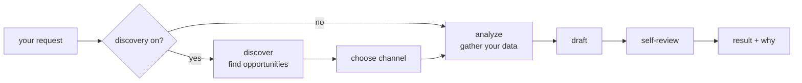

# SEO-OS

**An operating system for organic growth.** Bring your own data, install the
capabilities you want, and run agents that find the work, do it, and show you why
— on your stack, with no vendor you didn't choose.

```bash
git clone https://github.com/badrmada/seo-os && cd seo-os/services/seo-agents
python3.11 -m venv .venv && source .venv/bin/activate
pip install -r requirements.txt
mkdir -p userdata/acme && echo '{}' > userdata/acme/tenant.json
echo '{ "channel": "site_article", "seed_keyword": "your topic here" }' > userdata/acme/input.json
python src/main.py run --tenant acme
```

That's a complete run — analyze, draft, self-review — **with no API keys and no
network**, printing the full result so you can see exactly how it behaves before
connecting anything real. An empty `tenant.json` means "use the built-in fake for
every job."

---

## Why this exists

I was doing the SEO for [Echooers](https://echooers.com), a real anonymous social
app of mine, and the work was the same grind every week: find what's worth
writing about, pull the data, write it, check it, repeat. I wrote a script, then
the script became a system — and since every developer growing a product through
search is doing the identical loop with their own tools and their own data, it
made more sense to build it as something anyone can configure than as one more
private repo nobody else can use.

So the design goal was never "an SEO tool." It was: **whatever you already use
should plug in, and whatever you need that I've never heard of should plug in
too — without forking.**

## The idea: an OS, not a tool

An SEO tool decides what your growth process is. An operating system doesn't
decide anything — it gives you a kernel, a driver model, and a place to install
whatever you actually need.

SEO-OS is the second one, and the metaphor is literal. Every piece below is a real
mechanism in the code, not a marketing frame:

| OS concept | In SEO-OS | Means |
|---|---|---|
| **Kernel** | The run engine | Builds the pipeline, runs it, handles failure. Vendor-free — it knows interfaces, never brands. |
| **Drivers** | **Providers** | The implementation behind a job. `gemini`, `cloudflare`, `duckduckgo`, `redis` ship — so do `mock`, `templated` and `custom`. |
| **Devices** | **Signal sources** | Anything that feeds data in: a rank tracker, a backlink API, a trends export, your own dashboard. A named list, any length. |
| **Programs** | **Agent types** | A pipeline you run. `seo_content` (write something) ships; a site audit, a link report or a brief is one you declare. |
| **Home directory** | The **tenant folder** | One folder per configured agent: its config, its data, its plugins, its output. Many run side by side. |
| **Processes** | **Runs** | One request in, one result out, each with a `run_id`. |
| **`/proc`** | The **state store** | A snapshot after every step, so a UI or worker can watch a run that hasn't finished. |
| **stdout / pipes** | **Output sinks** | Where the result goes: stdout, a JSONL archive, a webhook, your own class. |
| **Installing a package** | Config, or one class | A `"custom"` provider is `"module:ClassName"` in your tenant's `plugins/`. Nothing in the kernel changes. |

The consequence worth internalizing: **there is no privileged vendor.** Google
Search Console, Cloudflare and Gemini are shipped drivers so your first real run
takes minutes instead of a day. Drop all three and the system is exactly as
capable.

## What's in the box

The default program is `seo_content`, and it will:

- **Read your data.** Traffic, product analytics and how your pages already rank
  reach the prompt as facts, from whichever tools you connected. Until you connect
  one, traffic and analytics stand in as fakes and your own seed keyword drives
  the run — a fixture is a fine stand-in for a *shape*, never for a decision you
  can already make better.
- **Write the draft** in your brand voice, toward your stated goal.
- **Review its own work** — word count, keyword presence, readability, undisclosed
  brand mentions, link density — attached as notes, never a silent block.
- **Explain itself.** Every run returns what it did and why, in the response.
  "Why did it write this?" is never a log-diving question.

Turn on **discovery** — one entry in `discovery_sources` — and it does the harder
half too:

- **Finds its own work.** It searches the live web (DuckDuckGo by default: no API
  key, no account, nothing to configure), has a model read the results, and
  surfaces the topics, threads and links worth acting on right now. A link it
  hands you is one search actually returned; a URL a model invented is thrown away
  rather than passed off as real.
- **Picks the right kind of content** — an article on your own site, an article
  for somewhere else, or a genuine reply in an existing conversation — from what
  it found. Tell it explicitly and it obeys instead; it only decides when you
  leave the choice open.

Grounding is the *system's* capability, not the model's, which is why swapping in
a local model or a gateway doesn't cost you it.

And a human reviews everything before it goes live. SEO-OS drafts; it doesn't
publish behind your back.



Discovery being off doesn't make those stages no-ops — they aren't in your
pipeline at all. The graph is built from your config.

## How far it bends: four levels

The same job — say, your product's analytics — can be answered at whichever level
matches what you have. This escalation is the whole design:

**Level 0 — the default.** Write nothing. A built-in fake stands in, the run
completes, and you learn the shape.

```jsonc
{}
```

**Level 1 — config.** You use a tool that ships as a driver. Two fields: which
provider, and that provider's own options.

```jsonc
{ "traffic_provider": "cloudflare",
  "traffic_options": { "api_token": "…", "zone_id": "…" } }
```

**Level 2 — a template, no code.** Your data is JSON with your own field names.
A short Jinja2 snippet reshapes it into what the agent expects. This covers most
analytics, traffic and rank data, including from a live API.

```jsonc
{ "analytics_provider": "templated",
  "analytics_options": {
    "source": "file", "report_path": "report.json",
    "summary_template": "{{ data.overview.signups }} signups and {{ data.overview.mau }} monthly actives."
  } }
```

**Level 3 — your class.** The logic is real code: a database query, a paginated
API, a multi-step research routine. Write one class with one method, point config
at it, and nothing in the kernel changes.

```jsonc
{ "analytics_provider": "custom", "analytics_custom_class": "analytics:MyAnalytics" }
```

That class can be a thin API wrapper or an entire multi-step agent of its own
(search → fetch → summarize) hiding behind the same interface. The kernel can't
tell the difference, which is the point.

## Real-world: what you actually wire in

Nobody's growth stack is only what ships here. These are the shapes that come up
most, with the real field names:

**Backlinks from Ahrefs, Majestic or Moz** — a signal source. The kernel has never
heard of them; it doesn't need to.

```jsonc
"signal_sources": [
  { "name": "backlinks", "provider": "templated",
    "options": {
      "source": "api",
      "api_url": "https://api.ahrefs.com/v3/site-explorer/backlinks-stats?target=example.com",
      "api_headers": { "Authorization": "Bearer YOUR_TOKEN" },
      "summary_template": "{{ data.metrics.live }} live backlinks from {{ data.metrics.live_refdomains }} referring domains."
    } }
]
```

That summary reaches your prompt as `{{ signals.backlinks.summary }}`. Add a
second signal and every prompt that loops over `signals` picks it up with no
template change.

**Other things people plug in the same way:**

| You want | You add |
|---|---|
| Rank data from a tracker that isn't Search Console | `"search_performance_provider": "templated"` over its JSON, from a file or its API |
| A trends feed, a competitor watcher, an internal dashboard | another `signal_sources` entry |
| Topic discovery from a tool you host | a `discovery_sources` entry with `"provider": "mcp"` — stdio or HTTP |
| A local model, a gateway, or a different vendor | `"llm_provider": "custom"` — grounding still works; it's the system's job, not the model's |
| The result posted to your CMS, Slack, or a queue | an `output_sinks` webhook, or a `custom` sink class |
| A progress bar in your own UI | `"state_provider": "file"` or `"redis"` — a snapshot per step, keyed by `run_id` |
| A different deliverable entirely — a site audit, a link report, a brief | your own `pipelines` entry with your own stages |

That last row is the strongest claim here, so it ships as proof rather than
prose: [`examples/08-custom-pipeline/`](services/seo-agents/examples/08-custom-pipeline/)
is a complete site audit — three stages, its own report template, its own output
`kind` — built entirely inside a tenant folder with **no change to the kernel**.

## Learn by example

Eight complete, runnable configurations. Every one runs offline with no keys, and
each shows the exact lines to change to go live.

| # | Product | Installs |
|---|---|---|
| [01](services/seo-agents/examples/01-starter-acme/) | Acme | The basics: two files, one run, reading the output. |
| [02](services/seo-agents/examples/02-saas-blog-pingowl/) | PingOwl (dev SaaS) | Templated analytics from a file, a custom article prompt. |
| [03](services/seo-agents/examples/03-ecommerce-roast-co/) | Roast & Co. (store) | Product-link highlights, `external_article`, self-review catching a real issue. |
| [04](services/seo-agents/examples/04-community-homelabhub/) | HomelabHub (forum) | Discovery, the agent choosing the channel itself, disclosure checks. |
| [05](services/seo-agents/examples/05-advanced-devboard/) | DevBoard (job board) | Custom Python analytics, a custom discovery source, two sources scored together. |
| [06](services/seo-agents/examples/06-mcp-discovery/) | Scribe | Discovery from an **MCP server**, with a stub server so it runs offline. |
| [07](services/seo-agents/examples/07-signal-inputs/) | Sproutly | **`signal_sources`** — a trends export and a rank tracker the project never heard of. |
| [08](services/seo-agents/examples/08-custom-pipeline/) | Sproutly | **A different deliverable** — a site audit from tenant-declared stages. |

Start at 01, then jump to whichever is closest to your product.

## The repository

SEO-OS is a monorepo of services. Today there is one, and it's the important one.

| Service | What it is | Status |
|---|---|---|
| [`services/seo-agents/`](services/seo-agents/) | **The kernel** — the run engine, the driver model, the CLI. Everything above lives here. | Shipped, tested, in use |
| `services/frontend/` | A UI over runs, tenants and drafts | Planned |
| `services/gateway/` | HTTP API, auth, queueing and scheduling in front of the kernel | Planned |

The kernel deliberately has no queue, no scheduler, no approval workflow and no
publishing. Those belong to the layer above it — and what it gives that layer is a
run whose state is durable and readable while it's still going, which is the seam
a queue needs, not the queue.

## Documentation

Start here, then go as deep as you need:

| Doc | Read it for |
|---|---|
| [seo-agents/README.md](services/seo-agents/README.md) | The full quickstart: the two files, a real `tenant.json` explained line by line, two runs compared. |
| [docs/configuration.md](services/seo-agents/docs/configuration.md) | Every config field, every provider's options, templates taught properly. |
| [docs/architecture.md](services/seo-agents/docs/architecture.md) | How the kernel is built: the pipeline, the three planes, grounding, how a failing tool degrades instead of crashing. |
| [docs/extending.md](services/seo-agents/docs/extending.md) | Writing your own driver, signal, sink, state store or pipeline stage — with full walkthroughs. |
| [docs/cli.md](services/seo-agents/docs/cli.md) | Every command, and how to add one. |
| [docs/output-schema.md](services/seo-agents/docs/output-schema.md) | The exact JSON a run returns, success and failure — the contract to build a UI on. |
| [docs/roadmap.md](services/seo-agents/docs/roadmap.md) | What's built, what's next, what's deliberately left out. |
| [DOCS_PLAN.md](DOCS_PLAN.md) | The state of these docs themselves. |

## Contributing

This is open source because the problem isn't specific to one product: anyone
growing something through search runs the same loop with a different set of tools.
Issues and pull requests are welcome.

The one thing worth reading first: if you're adding a whole new *kind* of
capability rather than another driver for an existing one, see
[extending.md](services/seo-agents/docs/extending.md#adding-a-new-provider-kind-not-just-a-new-instance).
Most integrations aren't that — they're a class in your own tenant folder, and
they need no change here at all.

```bash
cd services/seo-agents
pip install -r requirements.txt
pytest
```
