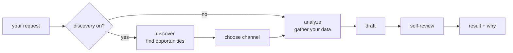

# SEO-OS

**An open-source AI agent that grows your product's organic traffic** — the
visitors who arrive through search and online conversations, not through ads.

You describe your product once. From then on, the agent goes looking for the
moments where your product is a genuine answer to something people are already
dealing with:

- **a conversation happening right now** where the problem being discussed is the
  one you solve — and where a real reply is welcome, not spam;
- **a search people are running** that you could rank for but don't yet;
- **a page you already have** that sits just off page one and needs one good
  article or improvement to get there.

It then writes the thing — the article, or the reply — in your voice, checks its
own work, and hands it to you with its reasoning attached. **Nothing is published
automatically.** A human approves every word.

It's a Swiss-army knife, not an appliance: every part of it — the AI model, the
web search, your analytics, where the result lands, even what it produces — is a
piece you choose and can replace. That's the "OS" in the name, and
[the section below](#why-os-and-not-just-a-tool) is what it buys you.

## What a run actually gives you

One request in, one JSON result out. Here's a run where the agent was told
nothing except "go find something" — it searched, found a live discussion about
honest anonymous feedback, judged that a genuine reply would land better than a
cold article, and wrote one:

```jsonc
{
  "phase": "done",
  "output": {
    "kind": "comment",
    "content": "Relate to this a lot re: \"why anonymous feedback gets people to be more honest\" — ran into the same thing myself. Full disclosure, I help build an anonymous posting platform for exactly this kind of conversation, no login or tracking involved, so no judgment either way.",
    "metadata": { "mentions_platform": false, "disclosure_included": true, "qa_notes": [] }
  },
  "discovery": {
    "opportunities": [
      {
        "source": "echooers_ideas",
        "topic": "why anonymous feedback gets people to be more honest",
        "signal_strength": 0.82,
        "intent": "discussion",
        "suggested_channel_hint": "engagement_comment",
        "reason": "A recent idea on the platform about honest feedback is getting unusually high engagement."
      }
    ],
    "channel_decision": {
      "chosen": "engagement_comment",
      "reason": "Highest-scoring channel hint across 1 discovered opportunity: {'engagement_comment': 0.82}.",
      "fallback": false
    }
  }
}
```

Read it bottom-up. **`discovery` is the answer to "why this?"** — what it found,
how strongly, and why it chose a reply over an article. **`output` is the thing
you review and post.** `disclosure_included: true` means it identified itself
rather than pretending to be a neutral bystander; `qa_notes` is empty because the
draft passed its own checks.

That reasoning is in every response, never buried in a log. It's the difference
between a tool you can trust with your brand's voice and one you have to
double-check by hand.

The full result schema, success and failure, is
[documented and frozen](services/seo-agents/docs/output-schema.md) — so you can
build a UI or a worker on top of it.

## Why this exists

I was doing the SEO for [Echooers](https://echooers.com), a real anonymous social
app of mine, and the work was the same grind every week: find what's worth
writing about, pull the data, write it, check it, repeat. I wrote a script, then
the script became a system — and since every developer growing a product through
search is doing the identical loop with their own tools and their own data, it
made more sense to build it as something anyone can configure than as one more
private repo nobody else can use.

So the design goal was never "an SEO tool." It was: **whatever you already use
should plug in, and whatever you need that I've never heard of should plug in
too — without forking.**

## Try it in 60 seconds

No API key, no account, no network. The built-in fakes let you watch a full run
before connecting anything real:

```bash
git clone https://github.com/badrmada/seo-os && cd seo-os/services/seo-agents
python3.11 -m venv .venv && source .venv/bin/activate
pip install -r requirements.txt
mkdir -p userdata/acme && echo '{}' > userdata/acme/tenant.json
echo '{ "channel": "site_article", "seed_keyword": "your topic here" }' > userdata/acme/input.json
python src/main.py run --tenant acme
```

An empty `tenant.json` means "use the built-in fake for everything." You get a
complete run — analyze, draft, self-review — and the full result printed, so you
can see exactly what you'd be wiring into before you wire anything.

## The seven words you need

You'll meet these on the first page of any doc here. Each links to the full
explanation:

| Word | Means |
|---|---|
| **[Agent](docs/concepts.md#4-an-agent-is-a-folder)** | One configured worker: your product's description, its voice, its goal, its tools. You can run several. |
| **[Tenant](docs/concepts.md#4-an-agent-is-a-folder)** | An agent's folder on disk — its config, data, code and output. "Tenant" is what the CLI calls it, because one process safely serves many. |
| **[Capability](docs/concepts.md#1-a-capability-is-a-job-an-interface-and-a-set-of-providers)** | A job an agent can do: write text, search the web, read your rankings, discover opportunities. Nine of them. |
| **[Provider](docs/concepts.md#1-a-capability-is-a-job-an-interface-and-a-set-of-providers)** | Which implementation does that job — Gemini or your own model, Cloudflare or your own numbers. Swappable by editing config. |
| **[Signal](docs/recipes.md#1-backlinks-ahrefs-majestic-moz-anything)** | Any data source feeding a run: a backlink API, a rank tracker, your own dashboard. A list of any length. |
| **[Specialist](docs/concepts.md#3-a-run-and-why-you-decide-whats-in-it)** | One step of a run — discover, choose, analyze, draft, review. A team, not one giant prompt. |
| **[Skill](docs/concepts.md#5-skills-the-deliverable-isnt-always-a-draft)** | A packaged deliverable you drop into an agent's folder, for when you want something other than an article. |

New here? **[docs/concepts.md](docs/concepts.md)** teaches all of it in one sitting.

## Why "OS", and not just a tool

An SEO tool decides what your growth process is: which model writes, which data
counts, what "content" even means. An operating system decides none of that. It
gives you a runtime, a capability model, and somewhere to install what you
actually need.

Concretely — here's every job in a run, what ships for it, and what you can put
there instead. There is no row you're stuck with:

| The job | Ships with | Or bring |
|---|---|---|
| Writing the text | Gemini | any model, local or hosted |
| Seeing the real web | DuckDuckGo, no key | your own search API — or turn it off |
| How your pages rank | Google Search Console | any tracker's JSON, or your own code |
| Traffic numbers | Cloudflare | any tool's JSON, or your own code |
| Product analytics | a template over your JSON | a live API, or a database query |
| Anything else that informs a run | — | backlinks, trends, your own dashboard |
| Finding opportunities | the model + live web search | an MCP server, or your own research agent |
| Where the result lands | stdout | a webhook, a JSONL archive, your CMS, Slack |
| Watching a run in progress | in memory | a file, Redis, or your own store |
| **What it produces at all** | an article or a reply | **your own pipeline** — an audit, a brief, a link report |

Two things that follow, which a tool can't give you:

- **No privileged vendor, and no privileged model.** Gemini, Search Console and
  Cloudflare ship so your first real run takes minutes instead of a day. Drop all
  three and the system is exactly as capable.
- **Grounding belongs to the runtime, not the model.** The agent searches the web
  itself and hands the results to whatever model you chose. So switching to a
  local model doesn't cost you real links — a claim most AI writing tools can't
  make, because for them grounding is the model's feature.

> On the word *skill*: it's the right modern name for this, so the docs use it —
> but there's no `skills` field to grep for. A skill here is spelled `pipelines`
> in config, plus classes in `plugins/` and templates in `templates/`, all inside
> one agent's folder.

## What's in the box

The agent that ships is `seo_content`, and it will:

- **Read your data.** Traffic, product analytics and how your pages already rank
  reach the prompt as facts, from whichever tools you connected. Until you connect
  one, traffic and analytics stand in as fakes and your own seed keyword drives
  the run — a fixture is a fine stand-in for *data*, never for a decision you can
  already make better.
- **Write the draft** in your brand voice, toward your stated goal.
- **Review its own work** — word count, keyword presence, readability, undisclosed
  brand mentions, link density — attached as notes, never a silent block.
- **Explain itself.** Every run returns what it did and why, in the response.
  "Why did it write this?" is never a log-diving question.

Turn on **discovery** — one entry in `discovery_sources` — and it does the harder
half too:

- **Finds the openings.** It searches the live web (DuckDuckGo by default: no API
  key, no account, nothing to configure), has a model read the results, and
  surfaces the discussions, questions and searches where your product is a real
  answer — scored, so you see which is worth acting on first. A link it
  hands you is one search actually returned; a URL a model invented is thrown away
  rather than passed off as real.
- **Picks the right kind of content** — an article on your own site, an article
  for somewhere else, or a genuine reply in an existing conversation — from what
  it found. Tell it explicitly and it obeys instead; it only decides when you
  leave the choice open.



Discovery being off doesn't make those stages no-ops — they aren't in your
pipeline at all. The graph is built from your config.

## How far it bends: four levels

The same job — say, your product's analytics — can be answered at whichever level
matches what you have. This escalation is the whole design:

**Level 0 — the default.** Write nothing. A built-in fake stands in, the run
completes, and you see the result schema.

```jsonc
{}
```

**Level 1 — config.** You use a tool that already ships as a provider. Two
fields: which provider, and that provider's own options.

```jsonc
{ "traffic_provider": "cloudflare",
  "traffic_options": { "api_token": "…", "zone_id": "…" } }
```

**Level 2 — a template, no code.** Your data is JSON with your own field names.
A short Jinja2 snippet maps it onto the fields the agent expects. This covers most
analytics, traffic and rank data, including from a live API.

```jsonc
{ "analytics_provider": "templated",
  "analytics_options": {
    "source": "file", "report_path": "report.json",
    "summary_template": "{{ data.overview.signups }} signups and {{ data.overview.mau }} monthly actives."
  } }
```

**Level 3 — your class.** The logic is real code: a database query, a paginated
API, a multi-step research routine. Write one class with one method, point config
at it, and nothing in the runtime changes.

```jsonc
{ "analytics_provider": "custom", "analytics_custom_class": "analytics:MyAnalytics" }
```

That class can be a thin API wrapper or an entire multi-step agent of its own
(search → fetch → summarize) hiding behind the same interface — a sub-agent, in
current terms. The runtime can't tell the difference, which is the point.

## Real-world: what you actually wire in

Nobody's growth stack is only what ships here. These are the integrations that
come up most, with the real field names:

**Backlinks from Ahrefs, Majestic or Moz** — a signal. The runtime has never heard
of them; it doesn't need to.

```jsonc
"signal_sources": [
  { "name": "backlinks", "provider": "templated",
    "options": {
      "source": "api",
      "api_url": "https://api.ahrefs.com/v3/site-explorer/backlinks-stats?target=example.com",
      "api_headers": { "Authorization": "Bearer YOUR_TOKEN" },
      "summary_template": "{{ data.metrics.live }} live backlinks from {{ data.metrics.live_refdomains }} referring domains."
    } }
]
```

That summary reaches your prompt as `{{ signals.backlinks.summary }}`. Add a
second signal and every prompt that loops over `signals` picks it up with no
template change.

**Other things people plug in the same way:**

| You want | You add |
|---|---|
| Rank data from a tracker that isn't Search Console | `"search_performance_provider": "templated"` over its JSON, from a file or its API |
| A trends feed, a competitor watcher, an internal dashboard | another `signal_sources` entry |
| Topic discovery from a tool you host | a `discovery_sources` entry with `"provider": "mcp"` — stdio or HTTP |
| A local model, a gateway, or a different vendor | `"llm_provider": "custom"` — grounding still works; it's the system's job, not the model's |
| The result posted to your CMS, Slack, or a queue | an `output_sinks` webhook, or a `custom` sink class |
| A progress bar in your own UI | `"state_provider": "file"` or `"redis"` — a snapshot per step, keyed by `run_id` |
| A different deliverable entirely — a site audit, a link report, a brief | your own `pipelines` entry with your own stages |

That last row is the strongest claim here, so it ships as proof rather than
prose: [`examples/08-custom-pipeline/`](services/seo-agents/examples/08-custom-pipeline/)
is a complete site audit — three stages, its own report template, its own output
`kind` — a skill living entirely in one agent's folder, with **no change to the
runtime**.

## Learn by example

Eight complete, runnable configurations. Every one runs offline with no keys, and
each shows the exact lines to change to go live.

| # | Product | Installs |
|---|---|---|
| [01](services/seo-agents/examples/01-starter-acme/) | Acme | The basics: two files, one run, reading the output. |
| [02](services/seo-agents/examples/02-saas-blog-pingowl/) | PingOwl (dev SaaS) | Templated analytics from a file, a custom article prompt. |
| [03](services/seo-agents/examples/03-ecommerce-roast-co/) | Roast & Co. (store) | Product-link highlights, `external_article`, self-review catching a real issue. |
| [04](services/seo-agents/examples/04-community-homelabhub/) | HomelabHub (forum) | Discovery, the agent choosing the channel itself, disclosure checks. |
| [05](services/seo-agents/examples/05-advanced-devboard/) | DevBoard (job board) | Custom Python analytics, a custom discovery source, two sources scored together. |
| [06](services/seo-agents/examples/06-mcp-discovery/) | Scribe | Discovery from an **MCP server**, with a stub server so it runs offline. |
| [07](services/seo-agents/examples/07-signal-inputs/) | Sproutly | **`signal_sources`** — a trends export and a rank tracker the project never heard of. |
| [08](services/seo-agents/examples/08-custom-pipeline/) | Sproutly | **A different deliverable** — a site audit from tenant-declared stages. |

Start at 01, then jump to whichever is closest to your product.

## The repository

SEO-OS is a monorepo of services. Today there is one, and it's the important one.

| Service | What it is | Status |
|---|---|---|
| [`services/seo-agents/`](services/seo-agents/) | **The runtime** — the agent engine, the capability model, the CLI. Everything above lives here. | Shipped, tested, in use |
| [`services/gateway/`](services/gateway/) | HTTP API, auth, queueing, scheduling and the approval loop | Planned — [next, after deployment](docs/roadmap.md#3-the-gateway-the-api-handler) |
| [`services/frontend/`](services/frontend/) | A UI over agents, runs and drafts — watch a run happen | Planned — [last, it needs the gateway](docs/roadmap.md#4-the-frontend-watching-an-agent-work) |
| [`deploy/`](deploy/) | Docker Compose for one host; a Helm chart for a cluster, later | Compose only, and nothing long-running to deploy until the gateway exists |

The runtime deliberately has no queue, no scheduler, no approval workflow and no
publishing. Those belong to the layer above it — and what it gives that layer is a
run whose state is durable and readable while it's still going, which is the seam
a queue needs, not the queue.

Tests and the documentation check run on every push
([`.github/workflows/`](.github/workflows/)); the image build and the deploy are
written and parked until the build is ready. The order the rest arrives in, and
why it's that order, is [docs/roadmap.md](docs/roadmap.md).

## Documentation

Start here, then go as deep as you need:

Everything is indexed at **[docs/](docs/)**. The short version:

| Doc | Read it for |
|---|---|
| [docs/concepts.md](docs/concepts.md) | **The model, properly** — the nine capabilities, the four levels of installing one, what a run is, and where your own code goes. Read this second. |
| [docs/recipes.md](docs/recipes.md) | **Wiring in what you already use** — backlink APIs, rank trackers, MCP servers, publishing to a CMS or Slack, watching runs from your own UI. |
| [seo-agents/README.md](services/seo-agents/README.md) | The full quickstart: the two files, a real `tenant.json` explained line by line, two runs compared. |
| [docs/configuration.md](services/seo-agents/docs/configuration.md) | Every config field, every provider's options, templates taught properly. |
| [docs/architecture.md](services/seo-agents/docs/architecture.md) | How the runtime is built: the pipeline, the specialists, grounding, how a failing tool degrades instead of crashing. |
| [docs/extending.md](services/seo-agents/docs/extending.md) | Writing your own provider, signal, sink, state store or pipeline stage — including a discovery source that's itself an agent. |
| [docs/cli.md](services/seo-agents/docs/cli.md) | Every command, and how to add one. |
| [docs/output-schema.md](services/seo-agents/docs/output-schema.md) | The exact JSON a run returns, success and failure — the contract to build a UI on. |
| [docs/roadmap.md](docs/roadmap.md) | What's built across the whole repo, and what's next — CI/CD, deployment, the gateway, the frontend, in that order. |

## Contributing

This is open source because the problem isn't specific to one product: anyone
growing something through search runs the same loop with a different set of tools.
Issues and pull requests are welcome.

**[CONTRIBUTING.md](CONTRIBUTING.md)** is the place to start — mostly because
for a large class of useful work, the right answer is *don't change this repo*.
Connecting a tool, adding a data source, publishing somewhere, producing a
different deliverable: all of that lives in your own agent's folder and ships
immediately. What's genuinely wanted here is the opposite report — **an extension
point that doesn't quite reach your case**, which is a real bug in the seams.

```bash
cd services/seo-agents
pip install -r requirements.txt
pytest
```

## License

[MIT](LICENSE). Use it, change it, ship it commercially — just keep the notice.
