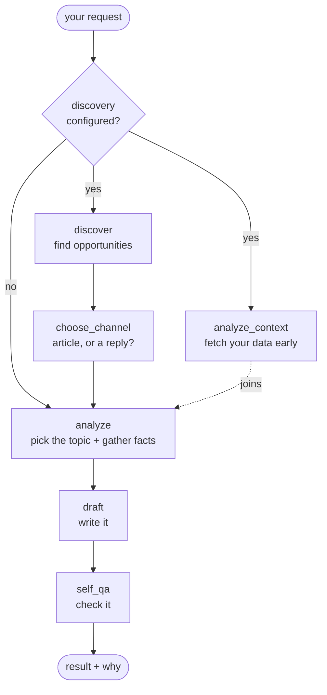

# Concepts

The [README](../README.md) states the model. This page teaches it — the six ideas
that, once you have them, make every other document here read as a detail rather
than a surprise.

It is deliberately not a reference. Every section ends by pointing at the page
that has the field names.

1. [A capability is a job, an interface, and a set of providers](#1-a-capability-is-a-job-an-interface-and-a-set-of-providers)
2. [Four levels of installing one](#2-four-levels-of-installing-one)
3. [A run, and why you decide what's in it](#3-a-run-and-why-you-decide-whats-in-it)
4. [An agent is a folder](#4-an-agent-is-a-folder)
5. [Skills: the deliverable isn't always a draft](#5-skills-the-deliverable-isnt-always-a-draft)
6. [Where does my thing go? The three planes](#6-where-does-my-thing-go-the-three-planes)

---

## 1. A capability is a job, an interface, and a set of providers

The runtime never knows a vendor. It knows **jobs**, and each job is defined by an
interface — a Python `Protocol` with one or two methods. Anything implementing
that interface can do that job, whether it ships here or you wrote it this
morning.

There are nine capabilities today. This is the whole surface — not a summary of
it:

| Capability | The job it answers | Interface | Providers that ship |
|---|---|---|---|
| `llm` | Write the text. | `LLMClient.generate()` | `gemini`, `mock`, `custom` |
| `search` | See the real web. | `SearchClient.search()` | `duckduckgo`, `none`, `mock`, `custom` |
| `search_performance` | How do my pages already rank? | `SearchPerformanceClient.search_analytics()` | `google`, `templated`, `none`, `mock`, `custom` |
| `traffic` | How many people are arriving? | `SiteTrafficClient.traffic_summary()` | `cloudflare`, `templated`, `none`, `mock`, `custom` |
| `analytics` | What's happening inside my product? | `AppAnalyticsClient.report()` | `templated`, `mock`, `custom` |
| `signal` | *Anything else that informs a run.* | `SignalSource.collect()` | `templated`, `mock`, `custom` |
| `discovery` | What's worth doing right now? | `OpportunitySource.discover()` | `llm`, `mcp`, `mock`, `custom` |
| `output` | Where does the result go? | `OutputSink.emit()` | `json`, `webhook`, `custom` |
| `state` | Where is this run right now? | `StateStore.save()/load()/delete()` | `memory`, `file`, `redis`, `custom` |

Two of those rows carry most of the flexibility:

- **`signal` is the open one.** A signal is anything the agent should know before
  it writes — if you'd want a human writer to glance at it first, that's a
  signal. The three named data capabilities above it exist because they get you
  to a real run in minutes, not because inputs come in three kinds. A backlink
  API, a rank tracker, a trends export, a competitor watcher, your support
  tickets, your product catalog, your internal dashboard — all `signal_sources`
  entries, a named list of any length, collected concurrently and failing
  independently. Adding a kind of input this project has never heard of is
  **config, not a fork**, and that is a deliberate architectural commitment
  rather than a convenience.

  A signal contributes *context*, never a decision: it changes what the writer
  knows, not which steps run, which keyword wins, or whether a draft passes.
  → [What a signal is, with use cases](../services/seo-agents/docs/configuration.md#what-a-signal-is)
- **`discovery` is what makes it an agent rather than a generator.** Without it,
  you say what to write about. With it, the system goes and finds out.

You never have to trust this table. `list-tools` prints it from the same registry
the runtime builds from, so it cannot describe a provider that doesn't exist or
omit one that does:

```bash
python src/main.py list-tools --all          # every capability, every provider
python src/main.py list-tools --tenant acme  # ...with your current choices marked
```

**Every method may be `def` or `async def`.** Write whichever suits the library
you're calling; the runtime awaits an async one and runs a sync one off the event
loop so it never blocks other runs. → [`src/tools/base.py`](../services/seo-agents/src/tools/base.py)

## 2. Four levels of installing one

Each capability can be answered at whichever level matches what you actually
have. This escalation is the design — not a fallback ladder, but four legitimate
resting places. Here is one job, product analytics, carried through all four.

### Level 0 — the default

Write nothing. A built-in fake stands in, the run completes end to end, and you
see the result schema before spending an API call.

```jsonc
{}
```

A fixture is the right stand-in for **data nothing else provides**. It is the
wrong stand-in for a **decision you can already make better** — which is why
`search_performance` defaults to `"none"` rather than to a fake. A mock that
invents rankings would quietly override the keyword you asked for. (That bug
shipped once here; the default was changed, not patched.)

### Level 1 — config: a provider that ships

Two fields, always the same two: which provider, and its own options.

```jsonc
{
  "traffic_provider": "cloudflare",
  "traffic_options": { "api_token": "…", "zone_id": "…" }
}
```

Options live **with the provider**, never at the top level, because which settings
are even meaningful depends on which provider you picked — `zone_id` means
something to Cloudflare and nothing to a templated feed. It also gives your own
class somewhere to put its settings, and keeps a credential next to the thing
that needs it.

### Level 2 — a template: your data, no code

Your analytics is JSON with your own field names. A short Jinja2 snippet maps
it onto the fields the runtime expects. Works against a file or a live API.

```jsonc
{
  "analytics_provider": "templated",
  "analytics_options": {
    "source": "file",
    "report_path": "data/report.json",
    "summary_template": "{{ data.overview.signups }} signups and {{ data.overview.mau }} monthly actives.",
    "highlights_template": "[{\"label\": {{ i.title|tojson }}, \"url\": {{ i.url|tojson }}},]"
  }
}
```

Two rules cover every template here: **`summary_template` renders to text**,
and anything named for a collection (`highlights_template`, `items_template`,
`facts_template`) renders to a **JSON array or object as a string**. Any option
ending in `_template` also accepts `{"file": "analytics.j2"}` so a real template
lives in a real file with real syntax highlighting, instead of one escaped line.

This level covers more than people expect — most analytics, traffic and rank data
never needs code.
→ [Templates, explained properly](../services/seo-agents/docs/configuration.md#templates-explained-properly-with-examples)

**A template like this is not a prompt.** Same Jinja2 syntax, different job:
this one maps *your data* into facts the agent holds. The prompt — the actual
words sent to the model — is a separate field, `prompt_templates`, one per
channel, and it decides what the agent *does* with those facts. Both are
optional, and both have working defaults.

```
your JSON ──(data template)──▸ a fact the agent holds ──(prompt template)──▸ what the model reads
```

→ [What a prompt template actually is](../services/seo-agents/docs/configuration.md#what-a-prompt-template-actually-is),
and `python src/main.py preview-prompt --tenant <name>` to see both ends of that
chain on your own config.

### Level 3 — your class

The logic is real code: a database query, a paginated API, a multi-step routine.
Write the interface's method. Nothing in the runtime changes.

```python
# userdata/acme/plugins/analytics.py
class PostgresAnalyticsClient:
    def __init__(self, config):          # or (self, config, options)
        self._dsn = os.environ["ANALYTICS_DB_DSN"]

    def report(self, limit: int = 5) -> dict:
        ...
        return {"summary": f"{total} ideas shared so far.", "highlights": highlights}
```

```jsonc
{ "analytics_provider": "custom", "analytics_custom_class": "analytics:PostgresAnalyticsClient" }
```

That class can be a thin API wrapper or an entire multi-step agent of its own —
search, fetch, summarize, score — behind the same one-method interface. A
**sub-agent**, in current terms, and the runtime cannot tell the difference. That
is the point: the complexity you need lives in your folder, not in a fork of this
one. [extending.md](../services/seo-agents/docs/extending.md#walkthrough-an-opportunity-source-thats-itself-an-agent)
walks through exactly that.

### Choosing a level

| Your data is | Use |
|---|---|
| whatever, you're just looking around | **Level 0** |
| in a tool that ships as a provider | **Level 1** |
| JSON, from a file or a plain HTTP endpoint | **Level 2** |
| behind a query, an SDK, pagination, or several steps | **Level 3** |

Moving up a level is a config edit. Nothing you built at a lower level is thrown
away, because every level satisfies the same interface.

## 3. A run, and why you decide what's in it

One request in, one result out. No queue, no background worker, no hidden state
between runs.

A run is **a team of specialists, not one giant prompt**. Each does one job and
hands its work to the next, which is why a run can explain itself: every decision
belongs to a step you can name, inspect, replace, or skip.



| Specialist | Does |
|---|---|
| `discover` | Asks every configured source what's worth acting on, concurrently. Each returns scored **opportunities**. |
| `choose_channel` | Turns those into one decision: site article, external article, or a reply — with its reasoning recorded. |
| `analyze_context` | Fetches analytics, traffic and every signal. A **direct child of the start**, so it runs alongside discovery rather than after it — none of it depends on the channel. |
| `analyze` | Picks the target topic and assembles the facts the writer gets. |
| `draft` | One model call, with your brand voice, your goal, and those facts. |
| `self_qa` | Word count, keyword presence, readability, undisclosed brand mentions, link density — attached as advisory notes. |

That graph is a real one: the runtime runs on
[LangGraph](https://github.com/langchain-ai/langgraph), each specialist a node
whose `run(state)` returns only the keys it changed. The dotted "joins" edge
above is an AND-join — `analyze` waits for both branches — and with two or more
discovery sources the `discover` node fans out one branch per source and merges
them.

**Which specialists run is a function of your config, not a fixed graph with
switches.** The graph is assembled from a spec your config produces, so a
tenant with no `discovery_sources` doesn't run `discover` as a no-op — the stage
isn't in their graph at all. Two or more sources fan out into one branch each and
merge. `show-graph` prints exactly what your config produces, needs no API key,
and builds no tools:

```bash
python src/main.py show-graph --tenant acme
python src/main.py show-graph --tenant acme --format mermaid
```

Three properties of a run are worth knowing before you build anything on it:

- **A failed run is a successful request.** The result comes back with
  `phase: "failed"` and an error in it. Only a request that could never start —
  unknown tenant, unloadable config — raises. An HTTP layer maps those
  differently: one is a 200 carrying a failed run, the other a 4xx.
- **A failing tool degrades; it doesn't crash the run.** A dead API contributes
  empty values and an entry in `discovery.tool_errors`, and the run continues on
  everything else. **A degrade that nothing records would be a bug** — every one
  of them lands somewhere you can read without turning on verbose mode.
- **The result JSON is frozen on purpose.** It's the contract a UI or control
  plane is built on, so a new kind of deliverable gets a new `kind` rather than a
  new top-level field. → [output-schema.md](../services/seo-agents/docs/output-schema.md)

And grounding belongs to the system, not the model: search runs first, the
model's own grounding is the fallback, ungrounded is the last resort. Swapping in
a local model or a gateway therefore doesn't cost you real links.

## 4. An agent is a folder

One configured agent — its goal, its voice, its capabilities, its code and its
data — is one folder. The runtime calls it a **tenant**, because one process
serves many:

```
userdata/                 the workspace (--userdata, $SEO_AGENT_USERDATA, or ./userdata)
└── acme/                 the tenant — `--tenant acme`
    ├── tenant.json       how this agent behaves. Set once.
    ├── input.json        what to do this run. Changes every run.
    ├── plugins/          your own Python
    ├── data/             your exports, credentials
    ├── templates/        your prompt and data templates
    └── output/           where results land
```

The split between the two files is the useful part: **`tenant.json` answers *how
should this agent behave*** (brand voice, providers, credentials — set once), and
**`input.json` answers *what should it do this time*** (channel, keyword, tone —
changes every run). One tenant runs against many inputs.

Every path inside a config resolves against **that tenant's folder**, never the
process's working directory. So the same command works from anywhere, and two
tenants that both say `data/analytics.json` get their own file. Plugins are
loaded per-tenant rather than onto `sys.path` for the same reason — otherwise two
tenants with a `plugins/analytics.py` each would collide, first import winning,
silently serving one tenant's code to another.

That isolation is what makes many tenants in one process safe. Runs are async and
share no state; everything a run touches is built for that run and belongs to it.

After editing a config, this is the command to reach for — it validates the
config and *builds* every provider without spending an API call:

```bash
python src/main.py check-data --tenant acme
```

→ [cli.md](../services/seo-agents/docs/cli.md) · [A tenant is a folder](../services/seo-agents/docs/configuration.md#a-tenant-is-a-folder)

## 5. Skills: the deliverable isn't always a draft

Writing an article is one way to grow a site. Telling someone what to fix on the
site they already have is another; so is a content brief, a link report, or a
competitor summary.

`seo_content` — the pipeline in §3 — is the one agent that ships. It is not the
only one you can run: an agent declares stages of its own and names the result.
This is what a **skill** is here — a packaged deliverable that lives in an agent's
folder rather than in this repo.

```jsonc
{
  "agent_type": "site_audit",
  "pipelines": {
    "site_audit": {
      "stages": [
        { "name": "crawl",    "class": "audit:CrawlStage", "options": { "pages_path": "data/crawl.json" } },
        { "name": "findings", "class": "audit:FindingsStage" },
        { "name": "verify",   "class": "audit:VerifyStage" }
      ]
    }
  }
}
```

A stage is a class taking `(tools, config)` — or `(tools, config, options)` — and
returning only the state keys it changes. It can sit beside the built-in stages;
leaving out `class` uses the one that ships under that name. One tenant can hold
several skills, and `--agent` picks one per run.

**This project deliberately ships no site-audit agent.** Which findings matter and
what a crawler does are your position to hold, not this repo's. What it ships is
the seam — and the proof that the seam is real:
[`examples/08-custom-pipeline/`](../services/seo-agents/examples/08-custom-pipeline/)
is a complete audit, stages and report template and fixtures, living entirely in
an agent's folder, producing `kind: "site_audit"` with **no change to the
runtime**.

Two constraints that page inherits, and so should anything like it: **if your
stage crawls, bound it** (obey `robots.txt`, rate-limit, cap pages and depth and
total time, identify yourself, never follow off-site links), and **findings must
be evidence-backed** — an audit that asserts problems it can't point at is worse
than no audit.
→ [agent types and pipelines](../services/seo-agents/docs/configuration.md#a-different-deliverable-agent-types-and-pipelines)

## 6. Where does my thing go? The three planes

Nearly every "where does this belong?" question is answered by which of three
planes a thing is in. They stay separate on purpose.

| Plane | What's in it | The rule |
|---|---|---|
| **Tools** | What a stage *calls*: the model, search, discovery sources, every signal input. | A stage depends only on the interfaces, never on a vendor. |
| **Run context** | How a run is *observed and delivered*: the verbose reporter, output sinks, the state store. | Never enters the tools, never enters the result. A stage cannot see any of it. |
| **Result** | The state and the JSON a run returns. | Frozen — it's the contract. |

The consequence you can feel: verbose mode, sinks and state snapshots all exist
without a single line of reporting or delivery code inside any stage.

The corollary is a rule anything added to the run-context plane inherits:
**that plane is *around* the run, so nothing in it may decide the run's
outcome.** A state store that can't write degrades and records; it does not turn
a run that produced a good draft into a failure.

→ [architecture.md](../services/seo-agents/docs/architecture.md) has the full
version, including how the pipeline is assembled and how errors propagate.

---

## Vocabulary

These docs use the words the AI ecosystem settled on. Each one maps to something
you can actually configure — nothing here is a label without a field behind it:

| Word | Means here | Spelled, in config or code |
|---|---|---|
| **Agent** | One configured worker: goal, voice, capabilities, pipeline. | a tenant folder + `tenant.json` |
| **Runtime** | The engine that builds an agent, runs it, and handles failure. | `AgentService`, `AgentRunner` |
| **Capability** | A job an agent can do, defined by an interface. | one of the nine in §1 |
| **Provider** | The implementation chosen for a capability. | `<capability>_provider` |
| **Tools** | What specialists call during a run. | `Tools`, `tools/base.py` |
| **Signal** | A data source feeding a run — the open-ended kind. | `signal_sources[]` |
| **Specialist** | One step in the pipeline: discover, choose, analyze, draft, review. | a stage; `list-specialists` |
| **Data template** | Maps your JSON into the facts a run holds. Never seen by the model. | any `*_template` on a provider |
| **Prompt template** | The literal text a specialist sends the model. | `prompt_templates.<channel>` |
| **Skill** | A packaged deliverable in an agent's folder: pipeline + stages + templates. | `pipelines`, `plugins/`, `templates/` |
| **Sub-agent** | A provider that is itself a multi-step agent. | a `"custom"` class |
| **MCP** | A Model Context Protocol server used as a source. | `"provider": "mcp"` |
| **Grounding** | Search-backed facts, so links are real. | `search_provider` |
| **Run** | One request in, one result out. | `run_id`, `RunResult` |
| **Run state** | The snapshot after each step, readable from outside. | `state_provider` |
| **Sink** | Where a finished result is delivered. | `output_sinks[]` |
| **Tenant** | The runtime's word for an agent, because one process serves many. | `--tenant` |

Two of these are worth a caveat, because the modern word and the field name
differ:

- **Skill** has no `skills` field. It's `pipelines` plus your `plugins/` and
  `templates/`. The word is right; grep for the fields.
- **Tenant** is the older, more precise term and it's what the CLI and the code
  say — it exists because isolation between agents is a real property here, not
  because agents are customers. Read "tenant" as "one agent's folder" everywhere.

## Where to go next

| You want to | Read |
|---|---|
| Run it on your own product | [seo-agents/README.md](../services/seo-agents/README.md) |
| Find every field | [configuration.md](../services/seo-agents/docs/configuration.md) |
| Wire in a tool you already pay for | [recipes.md](recipes.md) |
| Copy something close to your product | [examples/](../services/seo-agents/examples/) |
| Write your own provider, signal, sink or stage | [extending.md](../services/seo-agents/docs/extending.md) |
| Build a UI or a worker on top | [output-schema.md](../services/seo-agents/docs/output-schema.md) |
| Understand the runtime itself | [architecture.md](../services/seo-agents/docs/architecture.md) |
