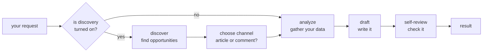

# seo-agents — the SEO-OS runtime

> This is the service. For what SEO-OS *is*, why it exists, and the vocabulary
> used throughout, start at the [repo root README](../../README.md) and
> [docs/concepts.md](../../docs/concepts.md). This page is how you run it.

The runtime builds and executes agents that grow a product's organic traffic —
the visitors who find you through search and online conversations, not through
ads.

You point an agent at your brand and your data. It looks around, finds an
opportunity worth acting on — a keyword you could rank for, a discussion you
could join, a topic worth writing about — decides what kind of content fits
best, and writes the draft. A human reviews it before anything goes live.

A run is a **team of specialists** rather than one giant prompt: one finds
opportunities, one decides the best channel, one gathers your data, one writes,
and one reviews the result. Each leans on **tools** you plug in — your analytics,
your traffic numbers, a search engine, or your own code. Out of the box it
searches the live web (via DuckDuckGo — no API key) to find what's worth writing
about right now, and it only recommends pages that search actually returned.

The idea in one line: **bring your data, bring your tools, customize the voice —
and let the agent do the repetitive growth work.**

## Who this is for

- **Developers** who want a content/SEO agent they can wire into their own
  stack, extend with their own code, and run without forking.
- **Non-technical founders and marketers** who want to understand what it does,
  try it, and configure it for their product by editing one file.

You can run the whole thing with zero setup and no API keys — it ships with
built-in fake data so you can see exactly how it behaves before connecting
anything real.

## What it does

- **Finds its own opportunities** *(optional)* — instead of waiting for you to
  say what to write about, it can go look. It searches the real web, asks an AI
  model to read the results, calls any API, or runs your own research code to
  surface topics, threads, and links worth acting on right now. A link it hands
  you is one search actually returned — a URL the model made up is thrown away,
  not passed off as real.
- **Picks the right kind of content** — based on what it found, it decides
  whether this run should be an article on your own site, an article for
  somewhere else (Medium, a partner blog), or a genuine reply in an existing
  conversation. Tell it explicitly and it does exactly that instead — it only
  decides for you when you leave the choice open.
- **Writes the draft** — it prompts an AI model using your brand voice, your
  goal, and whatever real analytics and traffic data you've connected.
- **Reviews its own work** — before handing the draft back, it runs quick
  automated checks: word count, whether the target keyword is present, how
  readable it is, whether it mentions your brand without disclosing the
  connection, how many links it packs in. These are attached to the draft as
  notes, never a silent block.
- **Explains itself** — every run tells you *what* it found and *why* it chose
  the channel it did. "Why did it write this?" always has an answer right there
  in the response, not buried in a log.

## How it works

Think of a run as an assembly line. Your request goes in one end; a finished
draft comes out the other. Along the way, a few specialists each do one job:



- **Discovery is optional.** If you haven't turned it on, the agent skips
  straight to gathering your data and writing — you tell it the channel and
  topic. If you *have* turned it on, it first goes and finds opportunities, then
  picks the channel that best fits what it found.
- **Every tool is swappable.** The AI model, your analytics, your traffic
  source, each discovery source — none of them are hardwired to a specific
  vendor. A zero-setup run uses built-in fakes for all of them and works
  completely offline. When you're ready, you swap in the real ones one at a
  time, just by editing config. See
  [Bring your own tools](#bring-your-own-tools-no-fork-required).

This is the short version. The full design — why the pipeline is assembled from
config instead of hardcoded, how opportunities get scored, how a failing tool
degrades gracefully instead of crashing the run — is in
**[docs/architecture.md](docs/architecture.md)**.

## Quickstart

### 1. Install

```bash
cd services/seo-agents
python3.11 -m venv .venv
source .venv/bin/activate
pip install -r requirements.txt
```

Or skip Python entirely and use the image — `make build` builds it, and
`ENGINE=docker` on the commands below runs through it instead of the virtualenv.
Everything in this quickstart works either way, because a tenant is a folder
either way: the venv reads it from disk, the container reads it through a mount.

`make` on its own lists every target ([Makefile](Makefile)) — `test`, `build`,
`push`, `run`, `example`, and `version`/`labels` for what a build would carry.
These are the same commands CI runs, which is the point of them existing here.

### 2. A tenant is a folder

Everything one configured agent owns lives in its own folder, and a run refers to
it by name:

```
userdata/                 the workspace
└── acme/                 the tenant name — `--tenant acme`
    ├── tenant.json       how this agent behaves. Set once.
    ├── input.json        what to write this run. Changes every run.
    ├── plugins/          your own code, if any
    ├── data/             your analytics/traffic files, credentials
    └── output/           where results land
```

| File | Answers the question | Changes how often |
|---|---|---|
| **`tenant.json`** | *How should this agent behave?* — your brand voice, which tools it uses, your credentials. | Rarely. Set once per product. |
| **`input.json`** | *What should it write on this specific run?* — the channel, keyword, tone. | Every run. |

The two are separate on purpose: one `tenant.json` can be run against many
different inputs. And because everything is anchored to the tenant's folder, the
same command works from any directory — and many tenants can run side by side
without treading on each other.

### 3. Run it once, offline

You can see the whole pipeline work with **no API keys** by using the built-in
fakes. Create a tenant:

```bash
mkdir -p userdata/acme
echo '{}' > userdata/acme/tenant.json
echo '{ "channel": "site_article", "seed_keyword": "your topic here" }' \
  > userdata/acme/input.json
```

An empty `tenant.json` means "use the built-in mock for everything". Then:

```bash
python src/main.py run --tenant acme
```

That's a complete run against fake data — it prints the full result so you can
see the exact result schema before connecting anything real.

The same run, through `make` or through the image:

```bash
make run TENANT=acme                  # the virtualenv above
make build && make run TENANT=acme ENGINE=docker
```

`make build` first because `ENGINE=docker` runs a *local* image; without it,
Docker tries to pull one and the Makefile stops with that advice rather than a
registry error. The plain `docker run` underneath is
`docker run --rm -v "$PWD/userdata:/userdata" ghcr.io/badrmada/seo-os/seo-agents:latest run --tenant acme`
— no `--userdata` flag, because the image sets `SEO_AGENT_USERDATA=/userdata` and
the mount is the flag.

### 4. Connect your real tools in `tenant.json`

When you're ready, replace that empty `userdata/acme/tenant.json` with real settings.
Here's a complete example (Echooers' setup, with secrets replaced by
placeholders). Copy it and fill in your own values:

Every job is two lines: **which provider**, and **that provider's own options**.

```jsonc
{
  // --- Which website is this? One vendor-neutral answer, used by every tool ---
  "site_url": "https://echooers.com",

  // --- The AI model that writes drafts ---
  "llm_provider": "gemini",
  "llm_options": {
    "model": "gemini-pro-latest",
    "api_key": "YOUR_GEMINI_API_KEY"
  },

  // --- Search performance: real keyword/ranking data for your site ---
  // A job, not a vendor — "templated" maps any rank export, "custom" runs your
  // own code, and the default "none" means the seed keyword drives the run.
  "search_performance_provider": "google",
  "search_performance_options": {
    "gsc_domain": "sc-domain:echooers.com",   // Google's own property identifier
    "key_file": "service_account.json"
  },

  // --- Website traffic numbers (this example reads them from Cloudflare) ---
  "traffic_provider": "cloudflare",
  "traffic_options": {
    "api_token": "YOUR_CLOUDFLARE_API_TOKEN",
    "zone_id": "YOUR_CLOUDFLARE_ZONE_ID"
  },

  // --- Your product's own analytics, mapped with a template (explained below) ---
  "analytics_provider": "templated",
  "analytics_highlights_limit": 3,
  "analytics_options": {
    "source": "file",
    "report_path": "tools/report.json",
    "summary_template": "{{ data.data.overview.total_ideas }} ideas shared so far, {{ data.data.overview.total_upvotes }} upvotes and {{ data.data.overview.total_views }} views across the community.",
    "highlights_template": "[{\"label\": {{ (i.content[:200] + \" (\" + i.upvotes|string + \" upvotes, \" + i.views|string + \" views)\")|tojson }}, \"url\": {{ (\"https://echooers.com/idea/\" + i.id)|tojson }}},]"
  },

  // --- Discovery: let an AI model find topics, grounded in a real web search ---
  // Search is on by default via DuckDuckGo — no key, no account, nothing to
  // configure. "search_provider": "none" turns it off.
  "discovery_sources": [
    { "name": "echooers_ideas", "provider": "llm", "max_opportunities": 5 }
  ],

  // --- Your brand voice and goal (this is where your brand is described) ---
  "brand_description": "An anonymous social platform, similar in spirit to Twitter/Reddit but with no login or signup: people post, vote, share, and comment freely without tracking or an identity attached, so they never have to fear reputation damage or backlash for what they say.",
  "agent_goal": "Increase qualified traffic to the platform — attract new visitors via search and genuine community discovery, not just serve people already there.",

  "default_article_tone": "informative",
  "default_comment_tone": "genuine and conversational",

  // --- Words that count as mentioning your brand (used by the self-review) ---
  "qa_brand_mention_keywords": [
    "our product", "our platform", "our app", "our service",
    "the platform", "the app", "the product", "the service",
    "anonymous", "no login", "no signup", "no tracking"
  ],

  // --- Optional: the actual text sent to the AI model for this channel ---
  // Leave it out and a generic built-in prompt is used. Set it and these are
  // the words the model reads, with {{ ... }} filled in from your config and
  // your data. `preview-prompt` prints the finished text without sending it.
  "prompt_templates": {
    "engagement_comment": "You're replying as a real community member.\nProduct: {{ brand_description }}\nReplying to: \"{{ context_text }}\"\nTone: {{ tone }}. Keep it to 2-3 sentences."
  }
}
```

**Gemini, Google Search Console and Cloudflare are not requirements.** They're
built-in integrations so that a first run against real data takes minutes
instead of a day — nothing more. Every one of them can be dropped or replaced:

| If you… | Write |
|---|---|
| don't use Cloudflare | `"traffic_provider": "templated"` (any traffic tool's JSON), or `"none"` |
| don't have Search Console set up | nothing — `search_performance_provider` defaults to `"none"`, and the agent uses your seed keyword, analytics, or discovery |
| have rank data from somewhere else (Bing, Ahrefs, a CSV) | `"search_performance_provider": "templated"` (any JSON), or `"custom"` + your class |
| use a different model, a local one, or a gateway | `"llm_provider": "custom"` + your class — grounding still works, it doesn't come from the model |
| have analytics in your own database | `"analytics_provider": "custom"` + your class |
| don't want the agent searching the web | `"search_provider": "none"` |
| have your own search API (Bing, Serper, SearxNG) | `"search_provider": "custom"` + your class |
| have a data source none of these covers (trends, rank tracking, a competitor watcher) | a `"signal_sources"` entry — a named list, any number of them, no fork |
| want to watch a run's progress from another process (a UI, a worker) | `"state_provider": "file"` or `"redis"` — a snapshot per step, keyed by `run_id` |

A `tenant.json` with three lines runs. Everything you leave out keeps a
sensible, product-neutral default, and `python src/main.py list-tools --all`
prints every provider you can choose from. Every field is documented in
**[docs/configuration.md](docs/configuration.md)**, which walks through this
exact example line by line.

> **A note on templates — there are two kinds, and they do different jobs.**
>
> **Data templates** (`summary_template`, `highlights_template`, and their
> relatives) feed the agent your product's own numbers **without writing any
> code**. Your analytics is just JSON with your own field names (here:
> `total_ideas`, `top_by_upvotes`, and so on); a data template is a short
> snippet that maps that JSON onto the two things the agent expects — a one-line
> **summary** and a short list of **highlights** (each a label plus a URL).
> They decide **what the agent knows**.
>
> **Prompt templates** (`prompt_templates`, further down the example) are the
> literal instructions sent to the AI model when it writes. They decide **what
> the agent does with what it knows** — the persona, the angle, what counts as a
> good draft for your brand. You never have to write one; leave the field out
> and a generic default is used.
>
> Both are Jinja2, and they chain: your JSON → a data template → a fact like
> `analytics_summary` → your prompt template → the words the model reads. Run
> `python src/main.py preview-prompt --tenant acme` to see the whole chain
> resolved on your own config, without calling the model.
>
> [docs/configuration.md](docs/configuration.md#templates-explained-properly-with-examples)
> covers data templates step by step, with ready-to-adapt examples for a SaaS
> app, an online store, and a website-traffic feed, and
> [prompt templates](docs/configuration.md#prompt-templates) covers every
> variable a prompt can use and how to write one that serves your goal. If your
> data needs real code instead of a template, see
> [docs/extending.md](docs/extending.md).

### 5. Describe each run with `input.json`

`input.json` says what to write *this time*. A few common scenarios:

**Write an SEO article for my own site, targeting a keyword:**

```json
{
  "channel": "site_article",
  "seed_keyword": "anonymous social media app",
  "params": { "max_words": 800, "tone": "friendly and practical" }
}
```

**Reply to a specific conversation:**

```json
{
  "channel": "engagement_comment",
  "context_text": "Why does anonymous feedback make people more honest?",
  "params": { "tone": "genuine and conversational" }
}
```

**Let the agent decide — no channel given (requires discovery turned on):**

```json
{
  "params": { "max_words": 600 }
}
```

In that last one, you leave `channel` out entirely. The agent looks at what
discovery found and picks the channel itself. The full list of input fields is
documented in [`agent/schemas/io.py`](src/agent/schemas/io.py)'s `AgentInput`.

### 6. Point at other files (optional)

Once you're running more than one product or scripting many runs, keep separate
files and pass their paths explicitly — then it doesn't matter which folder you
run from:

```bash
python src/main.py list-tenants                     # what's in the workspace
python src/main.py run --tenant globex              # a different one
python src/main.py run --tenant acme --input input.comment.json
python src/main.py run --tenant acme --userdata /srv/tenants
```

The workspace root is `--userdata`, else `$SEO_AGENT_USERDATA`, else the nearest
`userdata/` folder at or above where you are — so this works from anywhere in the
project.

### 7. Watch it work (optional)

A run is silent until its final JSON. Add `-v` to follow it live — every stage and
every tool call, with timings, as they happen:

```bash
python src/main.py run --tenant acme -v      # stages and tool calls
python src/main.py run --tenant acme -vv     # also prompts, responses, and decisions
```

Verbose output goes to stderr, so `python src/main.py run --tenant acme -v | jq` still works. See
[configuration.md](docs/configuration.md#watching-a-run-happen-verbose-mode).

### 8. The other commands (optional)

`run` is what you get by default, but it isn't the only thing:

```bash
python src/main.py check-data --tenant acme        # validate the config and build every tool, no LLM call
python src/main.py preview-prompt --tenant acme    # the exact prompt a draft would send, without sending it
python src/main.py show-graph --tenant acme        # which specialists will actually run
python src/main.py list-specialists --tenant acme  # what this agent has wired in
python src/main.py list-tools --all                # every provider available, with yours marked
python src/main.py list-tenants                    # what's in the workspace
python src/main.py --help                          # all of them
```

`check-data` is the one to reach for after editing a config — it catches a broken
template, a missing credentials file, or an unimportable custom class before a
run spends an API call. `preview-prompt` is the one to reach for when you want to
*understand* the agent: it prints the finished prompt — your brand voice, your
data, your wording, all resolved — so you can see exactly what the model is
being asked before it's asked. See [docs/cli.md](docs/cli.md).

### Learn by example

The **[examples/](examples/)** folder has eight complete, runnable setups for
different kinds of products — a developer SaaS, an online store, a community
forum, a job board, one that pulls discovery from an MCP server, and one whose
deliverable is a site audit rather than a draft — going from the simplest config
to plugging in your own code. Every one runs offline with no keys, and each shows
how to go live. It's the fastest way to find a starting point close to your own
product.

## Two real runs, side by side

Here are two runs against the same Echooers setup, producing very different
results — showing how the same config adapts to what you ask for.

**Run 1 — you ask for a site article.** You set `channel` to `site_article` and
give a site. The agent pulls real keyword data from your rank source, picks a
"striking distance" query (one you almost rank for), and drafts an article
around it:

```jsonc
{
  "output": {
    "kind": "site_article",
    "title": "The Complete Guide to Anonymous Social Media App",
    "content": "# The Complete Guide to Anonymous Social Media App\n\n...",
    "metadata": {
      "target_keyword": "anonymous social media app",
      "word_count": 123,
      "qa_notes": []
    }
  }
}
```

**Run 2 — you leave the channel open, and discovery is on.** The agent notices
that an idea on the platform about honest anonymous feedback is getting unusual
engagement, scores it, and decides a genuine reply beats a cold article this
time:

```jsonc
{
  "output": {
    "kind": "comment",
    "content": "Relate to this a lot re: \"why anonymous feedback gets people to be more honest...\" — ran into the same thing myself. Full disclosure, I help build an anonymous posting platform for exactly this kind of conversation, no login or tracking involved, so no judgment either way.",
    "metadata": { "mentions_platform": false, "disclosure_included": true, "qa_notes": [] }
  },
  "discovery": {
    "opportunities": [
      {
        "source": "echooers_ideas",
        "topic": "why anonymous feedback gets people to be more honest",
        "signal_strength": 0.82,
        "intent": "discussion",
        "suggested_channel_hint": "engagement_comment",
        "reason": "A recent idea on the platform about honest feedback is getting unusually high engagement."
      }
    ],
    "channel_decision": {
      "chosen": "engagement_comment",
      "reason": "Highest-scoring channel hint across 1 discovered opportunity: {'engagement_comment': 0.82}.",
      "fallback": false
    },
    "tool_errors": []
  }
}
```

That `discovery` block is the answer to "why did it decide that." It's always
in the response — you never have to go digging in logs. The full field-by-field
schema, including what a failed run looks like, is in
**[docs/output-schema.md](docs/output-schema.md)**.

## Key concepts

| Concept | What it means here |
|---|---|
| **Channel** | The kind of thing that gets written: `site_article` (an SEO article on your own site), `external_article` (an article for somewhere else — Medium, a partner blog), or `engagement_comment` (a genuine reply to an existing conversation). |
| **Provider** | The concrete tool behind a job. Options include `mock` (the offline fake), `templated` (your own data mapped with a template — no code), `custom` (your own code), real vendors (`gemini`, `google`, `cloudflare`), and — for discovery only — `llm` (the AI model itself does the finding). |
| **Signal** | Anything the agent should know before it writes — your rank tracker, backlinks, support tickets, product catalog, a trends export. A named list of any length (`signal_sources`), each one config rather than a fork. A signal contributes context, never a decision. See [use cases](docs/configuration.md#use-cases). |
| **Opportunity** | One thing worth acting on — a topic, a thread, an idea — with a source, a strength score, an intent, and (optionally) a hint about which channel suits it. This is what discovery produces. |
| **Tenant config** | One `tenant.json` per configured agent. It overrides only the fields you set; everything else keeps the default. The same product can run several agents side by side (different goal, voice, or channel mix), each from its own file. |
| **Self-review** | Quick automated checks on every draft (word count, keyword presence, undisclosed brand mentions, and so on). They're advisory notes attached to the output, never a silent block. |

## Documentation

| Doc | Read it for |
|---|---|
| [../../docs/concepts.md](../../docs/concepts.md) | The model behind all of this: capabilities, providers, specialists, skills — and the vocabulary these pages use. |
| [docs/cli.md](docs/cli.md) | Every command (`run`, `check-data`, `show-graph`, …), and how to add one of your own. |
| [docs/architecture.md](docs/architecture.md) | How the whole thing is built: the pipeline, the swappable-tool pattern, how discovery scores opportunities, how errors are handled. |
| [docs/configuration.md](docs/configuration.md) | Every config field, with the full Echooers example explained line by line. |
| [docs/extending.md](docs/extending.md) | Plugging in your own code — analytics, traffic, a signal input of your own, or a custom opportunity finder (including one that's its own mini-agent) — without forking. |
| [docs/output-schema.md](docs/output-schema.md) | The exact JSON a run returns (success and failure), for building a UI on top of it. |
| [../../docs/roadmap.md](../../docs/roadmap.md) | What's built and what's next — for this runtime and for the services around it. |
| [examples/](examples/) | Eight complete, runnable example configs (SaaS, e-commerce, community, job board, MCP, signal inputs, a site audit), simple to advanced. |

## Bring your own tools, no fork required

Every swappable piece — analytics, traffic, any other data source, opportunity
discovery — is defined by a small interface (a `Protocol`). To plug in your own:

1. `pip install -r requirements.txt` (plus whatever your own code needs).
2. Write one Python class with the method that interface expects — `def` or
   `async def`, whichever suits the library you're calling; the agent handles
   both.
3. Point your config at it: `"..._provider": "custom"`, and
   `"..._custom_class": "module.path:ClassName"`.

That's it — nothing inside `src/agent/` or `src/tools/` changes. Your class can
be anything from a thin API wrapper to a full multi-step research agent (search,
fetch, summarize) hiding behind the same interface. Full walkthroughs, including
a discovery source that's itself an agent, are in
[docs/extending.md](docs/extending.md).

## Out of scope (for now)

This agent drafts one thing per call and hands it back. It has no queue, no
background workers, no scheduling, no approval workflow, no publishing to a CMS
or a community, and no memory carried from one run into the next. Those belong to the
service layer above this one (see the [repo root](../../README.md#the-repository))
— what the runtime gives that layer is a run whose state it can read while it
happens (`"state_provider": "file"` or `"redis"`), not the layer itself. See
[../../docs/roadmap.md](../../docs/roadmap.md) for what *is* planned, and in what
order.

## Contributing

See the [root README](../../README.md#contributing) for the general pitch. The
one thing specific to this service: if you're adding a whole new *kind* of
capability (not just another provider for an existing one), read
[docs/extending.md](docs/extending.md#adding-a-new-provider-kind-not-just-a-new-instance)
first. Most integrations aren't that — they're a class in your own agent's
folder, needing no change here at all.

Running the tests:

```bash
pip install -r requirements.txt
pytest
```
</content>
</invoke>
