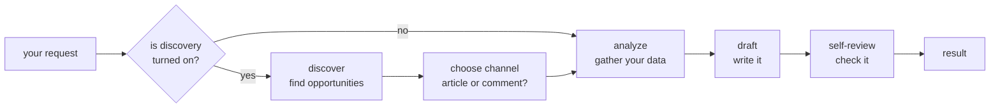

# Growth Agent

A small AI system that helps a product grow its organic traffic — the visitors
who find you through search and online conversations, not through ads.

You point it at your product and your data. It looks around, finds an
opportunity worth acting on — a keyword you could rank for, a discussion you
could join, a topic worth writing about — decides what kind of content fits
best, and writes the draft. A human reviews it before anything goes live.

It's built as a small **team of specialized workers** rather than one giant
prompt: one finds opportunities, one decides the best channel, one gathers your
data, one writes, and one reviews the result. Each worker leans on **tools** you
plug in — your analytics, your traffic numbers, a search engine, or your own
code. Out of the box it can search the live web (via Google Search) to find
what's worth writing about right now.

The idea in one line: **bring your data, bring your tools, customize the voice —
and let the agent do the repetitive growth work.**

## Who this is for

- **Developers** who want a content/SEO agent they can wire into their own
  stack, extend with their own code, and run without forking.
- **Non-technical founders and marketers** who want to understand what it does,
  try it, and configure it for their product by editing one file.

You can run the whole thing with zero setup and no API keys — it ships with
built-in fake data so you can see exactly how it behaves before connecting
anything real.

## Why this exists

Growing traffic organically is a grind. Writing SEO articles, getting mentioned
on other sites, showing up in the right conversations, tracking what's actually
working — it's constant, repetitive work, and doing it well every day is close
to a full-time job that most small teams can't staff.

This was built to solve that for one real product,
[**Echooers**](https://echooers.com), where the problem is especially hard.
Echooers is an anonymous platform: no user profiles, no author pages, nothing
personal to rank in search. There's no "easy" SEO to fall back on. But the same
challenge shows up for almost any product that grows through content and search
— which is why this is open source instead of a private internal script.
Configure it for your own product; no forking required.

## What it does

- **Finds its own opportunities** *(optional)* — instead of waiting for you to
  say what to write about, it can go look. It asks an AI model, calls a search
  engine or any API, or even runs your own research code to surface topics,
  threads, and links worth acting on right now.
- **Picks the right kind of content** — based on what it found, it decides
  whether this run should be an article on your own site, an article for
  somewhere else (Medium, a partner blog), or a genuine reply in an existing
  conversation. Tell it explicitly and it does exactly that instead — it only
  decides for you when you leave the choice open.
- **Writes the draft** — it prompts an AI model using your brand voice, your
  goal, and whatever real analytics and traffic data you've connected.
- **Reviews its own work** — before handing the draft back, it runs quick
  automated checks: word count, whether the target keyword is present, how
  readable it is, whether it mentions your product without disclosing the
  connection, how many links it packs in. These are attached to the draft as
  notes, never a silent block.
- **Explains itself** — every run tells you *what* it found and *why* it chose
  the channel it did. "Why did it write this?" always has an answer right there
  in the response, not buried in a log.

## How it works

Think of a run as an assembly line. Your request goes in one end; a finished
draft comes out the other. Along the way, a few specialized workers each do one
job:



- **Discovery is optional.** If you haven't turned it on, the agent skips
  straight to gathering your data and writing — you tell it the channel and
  topic. If you *have* turned it on, it first goes and finds opportunities, then
  picks the channel that best fits what it found.
- **Every tool is swappable.** The AI model, your analytics, your traffic
  source, each discovery source — none of them are hardwired to a specific
  vendor. A zero-setup run uses built-in fakes for all of them and works
  completely offline. When you're ready, you swap in the real ones one at a
  time, just by editing config. See
  [Bring your own tools](#bring-your-own-tools-no-fork-required).

This is the short version. The full design — why the pipeline is assembled from
config instead of hardcoded, how opportunities get scored, how a failing tool
degrades gracefully instead of crashing the run — is in
**[docs/architecture.md](docs/architecture.md)**.

## Quickstart

### 1. Install

```bash
cd services/agents-workers
python3.11 -m venv .venv
source .venv/bin/activate
pip install -r requirements.txt
```

### 2. Understand the two files a run reads

Every run reads two JSON files: **`tenant.json`** and **`input.json`**. By
default the app looks for them by those names **in the folder you run the
command from** (pass `--tenant` / `--input` to use any other path). If a file
isn't there, it stops with a clear message rather than guessing.

| File | Answers the question | Changes how often |
|---|---|---|
| **`tenant.json`** | *How should this agent behave?* — your brand voice, which tools it uses, your credentials. | Rarely. Set once per product. |
| **`input.json`** | *What should it write on this specific run?* — the channel, keyword, tone. | Every run. |

The two are separate on purpose: one `tenant.json` (your product's settings) can
be run against many different `input.json` files (one per request).

### 3. Run it once, offline

You can see the whole pipeline work with **no API keys** by using the built-in
fakes. Create these two files in `src/` (that's where we'll run from):

`src/tenant.json` — an empty object means "use the built-in mock for everything":

```json
{}
```

`src/input.json`:

```json
{ "channel": "site_article", "gsc_domain": "sc-domain:example.com", "seed_keyword": "your topic here" }
```

Then run it from `src/` so it finds those files:

```bash
cd src
python main.py
```

That's a complete run against fake data — it prints the full result so you can
see the exact shape before connecting anything real.

### 4. Connect your real tools in `tenant.json`

When you're ready, replace that empty `src/tenant.json` with real settings.
Here's a complete example (Echooers' setup, with secrets replaced by
placeholders). Copy it and fill in your own values:

```jsonc
{
  // --- The AI model that writes drafts ---
  "llm_provider": "gemini",
  "llm_model": "gemini-pro-latest",
  "gemini_api_key": "YOUR_GEMINI_API_KEY",

  // --- Google Search Console: real keyword/ranking data for your site ---
  "gsc_provider": "google",
  "gsc_key_file": "service_account.json",

  // --- Website traffic numbers (this example reads them from Cloudflare) ---
  "traffic_provider": "cloudflare",
  "cloudflare_api_token": "YOUR_CLOUDFLARE_API_TOKEN",
  "cloudflare_zone_id": "YOUR_CLOUDFLARE_ZONE_ID",

  // --- Your product's own analytics, mapped with a template (explained below) ---
  "analytics_provider": "templated",
  "analytics_source": "file",
  "analytics_report_path": "tools/report.json",
  "analytics_highlights_limit": 3,
  "analytics_summary_template": "{{ data.data.overview.total_ideas }} ideas shared so far, {{ data.data.overview.total_upvotes }} upvotes and {{ data.data.overview.total_views }} views across the community.",
  "analytics_highlights_template": "[{\"label\": {{ (i.content[:200] + \" (\" + i.upvotes|string + \" upvotes, \" + i.views|string + \" views)\")|tojson }}, \"url\": {{ (\"https://echooers.com/idea/\" + i.id)|tojson }}},]",

  // --- Discovery: let an AI model (backed by live Google Search) find topics ---
  "discovery_sources": [
    { "name": "echooers_ideas", "provider": "llm", "max_opportunities": 5 }
  ],

  // --- Your brand voice and goal (this is where your product is described) ---
  "brand_description": "An anonymous social platform, similar in spirit to Twitter/Reddit but with no login or signup: people post, vote, share, and comment freely without tracking or an identity attached, so they never have to fear reputation damage or backlash for what they say.",
  "agent_goal": "Increase qualified traffic to the platform — attract new visitors via search and genuine community discovery, not just serve people already there.",

  "default_article_tone": "informative",
  "default_comment_tone": "genuine and conversational",

  // --- Words that count as mentioning your product (used by the self-review) ---
  "qa_brand_mention_keywords": [
    "our product", "our platform", "our app", "our service",
    "the platform", "the app", "the product", "the service",
    "anonymous", "no login", "no signup", "no tracking"
  ],

  // --- Optional: override the wording of a specific channel's prompt ---
  "prompt_templates": {
    "engagement_comment": "You're replying as a real community member.\nProduct: {{ brand_description }}\nReplying to: \"{{ context_text }}\"\nTone: {{ tone }}. Keep it to 2-3 sentences."
  }
}
```

You don't need every field. A `tenant.json` with just a few lines works fine —
anything you leave out keeps a sensible, product-neutral default. Every field,
what it does, and every provider option is documented in
**[docs/configuration.md](docs/configuration.md)**, which walks through this
exact example line by line.

> **A note on the two `templated` lines above.** `analytics_summary_template`
> and `analytics_highlights_template` are how you feed the agent your product's
> own analytics **without writing any code**. Your analytics is just JSON with
> your own field names (here: `total_ideas`, `top_by_upvotes`, and so on). A
> template is a short snippet that reshapes that JSON into the two things the
> agent expects: a one-line **summary** and a short list of **highlights**
> (each a label plus a URL). This is worth understanding well —
> [docs/configuration.md](docs/configuration.md#templates-explained-properly-with-examples)
> explains it step by step with ready-to-adapt examples for a SaaS app, an
> online store, and a website-traffic feed. If your data needs real code instead
> of a template, see [docs/extending.md](docs/extending.md).

### 5. Describe each run with `input.json`

`input.json` says what to write *this time*. A few common scenarios:

**Write an SEO article for my own site, targeting a keyword:**

```json
{
  "channel": "site_article",
  "gsc_domain": "sc-domain:echooers.com",
  "seed_keyword": "anonymous social media app",
  "params": { "max_words": 800, "tone": "friendly and practical" }
}
```

**Reply to a specific conversation:**

```json
{
  "channel": "engagement_comment",
  "context_text": "Why does anonymous feedback make people more honest?",
  "params": { "tone": "genuine and conversational" }
}
```

**Let the agent decide — no channel given (requires discovery turned on):**

```json
{
  "gsc_domain": "sc-domain:echooers.com",
  "params": { "max_words": 600 }
}
```

In that last one, you leave `channel` out entirely. The agent looks at what
discovery found and picks the channel itself. The full list of input fields is
documented in [`agent/schemas/io.py`](src/agent/schemas/io.py)'s `AgentInput`.

### 6. Point at other files (optional)

Once you're running more than one product or scripting many runs, keep separate
files and pass their paths explicitly — then it doesn't matter which folder you
run from:

```bash
python src/main.py --tenant path/to/other-tenant.json --input path/to/other-input.json
```

### Learn by example

The **[examples/](examples/)** folder has six complete, runnable setups for
different kinds of products — a developer SaaS, an online store, a community
forum, a job board, and one that pulls discovery from an MCP server — going from
the simplest config to plugging in your own code. Every one runs offline with no
keys, and each shows how to go live. It's the fastest way to find a starting
point close to your own product.

## Two real runs, side by side

Here are two runs against the same Echooers setup, producing very different
results — showing how the same config adapts to what you ask for.

**Run 1 — you ask for a site article.** You set `channel` to `site_article` and
give a domain. The agent pulls real keyword data from Search Console, picks a
"striking distance" query (one you almost rank for), and drafts an article
around it:

```jsonc
{
  "output": {
    "kind": "site_article",
    "title": "The Complete Guide to Anonymous Social Media App",
    "content": "# The Complete Guide to Anonymous Social Media App\n\n...",
    "metadata": {
      "target_keyword": "anonymous social media app",
      "word_count": 123,
      "qa_notes": []
    }
  }
}
```

**Run 2 — you leave the channel open, and discovery is on.** The agent notices
that an idea on the platform about honest anonymous feedback is getting unusual
engagement, scores it, and decides a genuine reply beats a cold article this
time:

```jsonc
{
  "output": {
    "kind": "comment",
    "content": "Relate to this a lot re: \"why anonymous feedback gets people to be more honest...\" — ran into the same thing myself. Full disclosure, I help build an anonymous posting platform for exactly this kind of conversation, no login or tracking involved, so no judgment either way.",
    "metadata": { "mentions_platform": false, "disclosure_included": true, "qa_notes": [] }
  },
  "discovery": {
    "opportunities": [
      {
        "source": "echooers_ideas",
        "topic": "why anonymous feedback gets people to be more honest",
        "signal_strength": 0.82,
        "intent": "discussion",
        "suggested_channel_hint": "engagement_comment",
        "reason": "A recent idea on the platform about honest feedback is getting unusually high engagement."
      }
    ],
    "channel_decision": {
      "chosen": "engagement_comment",
      "reason": "Highest-scoring channel hint across 1 discovered opportunity: {'engagement_comment': 0.82}.",
      "fallback": false
    },
    "tool_errors": []
  }
}
```

That `discovery` block is the answer to "why did it decide that." It's always
in the response — you never have to go digging in logs. The full field-by-field
shape, including what a failed run looks like, is in
**[docs/output-schema.md](docs/output-schema.md)**.

## Key concepts

| Concept | What it means here |
|---|---|
| **Channel** | The kind of thing that gets written: `site_article` (an SEO article on your own site), `external_article` (an article for somewhere else — Medium, a partner blog), or `engagement_comment` (a genuine reply to an existing conversation). |
| **Provider** | The concrete tool behind a job. Options include `mock` (the offline fake), `templated` (your own data reshaped with a template — no code), `custom` (your own code), real vendors (`gemini`, `google`, `cloudflare`), and — for discovery only — `llm` (the AI model itself does the finding). |
| **Opportunity** | One thing worth acting on — a topic, a thread, an idea — with a source, a strength score, an intent, and (optionally) a hint about which channel suits it. This is what discovery produces. |
| **Tenant config** | One `tenant.json` per configured agent. It overrides only the fields you set; everything else keeps the default. The same product can run several agents side by side (different goal, voice, or channel mix), each from its own file. |
| **Self-review** | Quick automated checks on every draft (word count, keyword presence, undisclosed brand mentions, and so on). They're advisory notes attached to the output, never a silent block. |

## Documentation

| Doc | Read it for |
|---|---|
| [docs/architecture.md](docs/architecture.md) | How the whole thing is built: the pipeline, the swappable-tool pattern, how discovery scores opportunities, how errors are handled. |
| [docs/configuration.md](docs/configuration.md) | Every config field, with the full Echooers example explained line by line. |
| [docs/extending.md](docs/extending.md) | Plugging in your own code — analytics, traffic, or a custom opportunity finder (including one that's its own mini-agent) — without forking. |
| [docs/output-schema.md](docs/output-schema.md) | The exact JSON a run returns (success and failure), for building a UI on top of it. |
| [docs/roadmap.md](docs/roadmap.md) | What's built, what's next, and what's deliberately left out. |
| [examples/](examples/) | Six complete, runnable example configs (SaaS, e-commerce, community, job board, MCP), simple to advanced. |

## Bring your own tools, no fork required

Every swappable piece — analytics, traffic, opportunity discovery — is defined
by a small interface (a `Protocol`). To plug in your own:

1. `pip install -r requirements.txt` (plus whatever your own code needs).
2. Write one Python class with the method that interface expects.
3. Point your config at it: `"..._provider": "custom"`, and
   `"..._custom_class": "module.path:ClassName"`.

That's it — nothing inside `src/agent/` or `src/tools/` changes. Your class can
be anything from a thin API wrapper to a full multi-step research agent (search,
fetch, summarize) hiding behind the same interface. Full walkthroughs, including
a discovery source that's itself an agent, are in
[docs/extending.md](docs/extending.md).

## Out of scope (for now)

This agent drafts one thing per call and hands it back. It has no queue, no
background workers, no scheduling, no approval workflow, no publishing to a CMS
or a community, and no memory beyond a single run. Those are a separate,
worker-shaped layer you'd build on top. See [docs/roadmap.md](docs/roadmap.md)
for what *is* planned inside the agent itself.

## Contributing

This is open source so other teams facing the same problem — growth for a
product that doesn't fit the usual SEO playbook — can use it and improve it.
Issues and pull requests are welcome. If you're adding a whole new *kind* of
provider (not just a new instance of an existing one), read
[docs/extending.md](docs/extending.md#adding-a-new-provider-kind-not-just-a-new-instance)
first.
</content>
</invoke>
