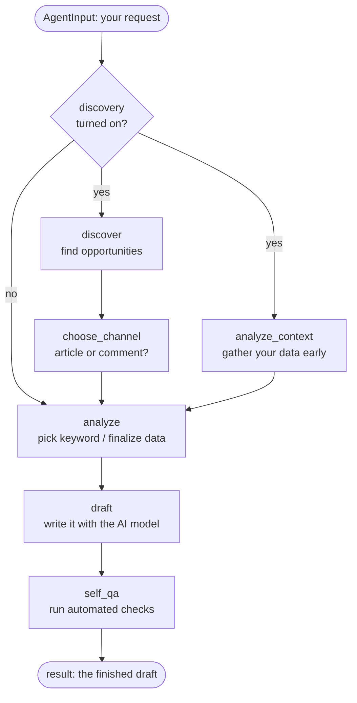

# Architecture

This is the deep dive on how the agent is built and why. If you just want to run
it, start with the [README](../README.md). For the full list of config fields,
see [configuration.md](configuration.md). To plug in your own tool without
forking, see [extending.md](extending.md).

## The big picture

The agent is a small **pipeline**: a fixed sequence of steps, each doing one job
and passing its work to the next. One call to `AgentRunner.arun(input_data)`
builds the pipeline, runs it once, and returns a finished result. There's no
queue and no background worker — one call in, one draft out. (`run()` is the
same thing for callers with no event loop, like the CLI.)

Three design ideas shape everything below, so it's worth stating them up front:

1. **Every step talks to tools through an interface, never a specific vendor.**
   A step that needs traffic data calls "the traffic tool" — it doesn't know or
   care whether that's Cloudflare, a fake, or your own code. This is what lets
   the same pipeline run offline with fakes or in production with real vendors,
   with no change to the steps themselves.
2. **The pipeline's shape is decided from config, not hardcoded.** A product
   that hasn't turned on discovery gets a shorter pipeline. The steps that
   handle discovery don't run as empty no-ops — they simply aren't part of that
   product's pipeline at all.
3. **Many runs share one process.** Runs are async and hold no shared state, so
   several tenants' runs proceed at once on one event loop. Everything a run
   touches — config, tools, reporter, result — is built per run and belongs to
   that run alone.

### Three planes

Almost every question about "where does this belong?" is answered by which of
these three a thing is part of. They stay separate on purpose.

| Plane | What's in it | Rule |
|---|---|---|
| **Tools** | What a step *calls*: the LLM, web search, discovery sources, and every signal input — search performance, analytics, traffic, plus whatever else the tenant configured. Bundled in `Tools`, built by `ToolsManager`. | A step depends only on the interfaces in [`tools/base.py`](../src/tools/base.py). |
| **Run context** | How a run is *observed and delivered*: the verbose reporter, the output sinks, the state store. | Never enters `Tools` and never enters the result state — a step can't see any of it. |
| **Result** | `AgentState` and the JSON a run returns, documented in [output-schema.md](output-schema.md). | Deliberately frozen: it's the contract a UI or control plane is built on. |

That's why verbose mode, sinks, and state snapshots exist without a single line
of reporting or delivery code inside any step — see [The run-context
plane](#the-run-context-plane-observing-and-delivering-a-run).

## What one run looks like

Here's the full pipeline. The exact steps depend on whether discovery is turned
on (that's the diamond at the top):



Read it top to bottom. Three things are worth calling out:

1. **No discovery? The pipeline is just three steps:** `analyze → draft →
   self_qa`. You supply the channel and topic up front, like any normal content
   pipeline. The `discover`, `choose_channel`, and `analyze_context` steps
   aren't skipped — they were never added to this product's pipeline in the
   first place.

2. **With discovery on, the agent can pick the channel itself.** If you didn't
   set `channel` in your input, `choose_channel` looks at what `discover` found
   and decides whether this run should be an article or a comment. If you *did*
   set `channel`, that always wins — discovery only fills in a blank.

3. **Two things happen at once, on purpose.** When discovery is on, gathering
   your analytics/traffic data (`analyze_context`) doesn't need to wait for
   discovery to finish — the two run side by side. `analyze` then waits for both
   before doing its final, channel-dependent work (like picking a keyword). This
   just saves time; the result is identical either way. The wiring behind that
   is explained in [How the pipeline is
   assembled](#how-the-pipeline-is-assembled) below.

## The steps, in plain terms

| Step | Job | Runs when |
|---|---|---|
| `discover` | Call every configured opportunity source and collect what they find. | Discovery is on. |
| `choose_channel` | Score the opportunities and pick the channel — unless you already picked one. | Discovery is on. |
| `analyze_context` | Collect analytics, traffic and every configured signal early — all concurrently, in parallel with discovery. | Discovery is on. |
| `analyze` | Finalize the data, collecting that same context itself when `analyze_context` didn't run. For article channels, pull Search Console rows and pick the best keyword to target. | Always. |
| `draft` | Build a prompt from your brand voice, goal, and data, and ask the AI model to write the draft. | Always. |
| `self_qa` | Run quick automated checks on the draft and attach the notes. Produce the final `output`. | Always. |

Each step reads some state, does its work, and writes new state for the next
step. The precise list of which key each step reads and writes lives in the
docstrings on [`agent/schemas/io.py`](../src/agent/schemas/io.py)'s `AgentState`
— that file is the source of truth.

## How the pipeline is assembled

The pipeline runs on [LangGraph](https://github.com/langchain-ai/langgraph), a
small library for wiring steps into a graph. Each step is a plain Python object
with an `async def run(state) -> dict` method. Whatever it returns gets merged into the
shared state before the next step runs. There's no branching or approval logic
*inside* the pipeline — those belong to a control layer built on top, not to the
agent.

The interesting part is how the graph gets built.
[`agent/graph/pipeline.py`](../src/agent/graph/pipeline.py)'s `build_graph()`
does **not** hardcode a list of steps. Instead it reads a small **spec** — a
plain list of step names — and wires up exactly those steps. The built-in
`seo_content` spec is built from your config:

```python
def _default_spec(config) -> PipelineSpec:
    stages = []
    if config.discovery_sources:
        mode = "parallel_by_source" if len(config.discovery_sources) > 1 else "sequential"
        stages.append(PipelineStage("discover", mode=mode))
        stages.append(PipelineStage("choose_channel"))
        stages.append(PipelineStage("analyze_context", mode="concurrent_from_start"))
    stages += [PipelineStage("analyze"), PipelineStage("draft"), PipelineStage("self_qa")]
    return PipelineSpec(stages=tuple(stages))
```

The payoff: adding a new step to the pipeline means adding it to this spec and a
registry of steps — not rewriting the graph-building code by hand. Most steps
run one after another, but a step can ask for a different shape through its
`mode`:

- **`parallel_by_source`** (used by `discover` when you have 2+ sources) — run
  every opportunity source at the same time instead of one after another, then
  merge their results. With 0 or 1 source there's nothing to parallelize, so it
  stays sequential. Same per-source logic either way; only the timing differs.

- **`concurrent_from_start`** (used by `analyze_context`) — start this step
  immediately, in parallel with the `discover → choose_channel` chain, instead
  of after it. `analyze` then waits for *both* branches to finish before it
  runs. In LangGraph terms this is an "AND-join": you tell it one step depends
  on a **list** of predecessors, and it waits for all of them. (Getting this
  wrong — wiring each predecessor separately — would let `analyze` fire as soon
  as *either* branch finished, which could corrupt the shared state. The single
  list form is what guarantees it waits for both.)

### More than one pipeline: agent types

`seo_content` is *a* spec, not *the* spec. `config.pipelines` maps a name to a
list of stages, each of which may be one of your own classes from `plugins/`, and
`--agent <name>` picks one per run:

```jsonc
"agent_type": "site_audit",
"pipelines": { "site_audit": { "stages": [
  {"name": "crawl",    "class": "audit:CrawlStage"},
  {"name": "findings", "class": "audit:FindingsStage"},
  {"name": "verify",   "class": "audit:VerifyStage"}
]}}
```

This is what makes "the deliverable is not always a draft" something you can act
on. A site audit, a content brief, a link report: same tools plane, same result
schema, a different `output.kind` — and nothing in `src/` needs to know your
agent type exists. Full reference in
[configuration.md](configuration.md#a-different-deliverable-agent-types-and-pipelines);
worked example in [`examples/08-custom-pipeline/`](../examples/08-custom-pipeline/).

Two details worth knowing because they were deliberate:

- **A mode is available to any stage that meets its requirement**, not to a stage
  with a particular name. `build_graph` used to accept `parallel_by_source` only
  for a stage literally called `discover`; now the requirement is that the class
  *declares* a fan-out (`fanout_over`/`fanout_branch`/`fanout_join`), so your
  stage can use it too. `concurrent_from_start`'s requirement is structural —
  something must follow it to join into.
- **A pipeline with no channel-aware stage has no `channel`.** `channel` picks
  which of three things `seo_content` drafts; an audit isn't drafting, so nothing
  invents a `"site_article"` for it — see `AgentRunner._run`.

## Calling the agent: the service layer

Everything a run needs doing *around* the pipeline — resolve the tenant's config,
build the tools, build a reporter, run, emit to the output sinks, keep the state
snapshots — lives in one place,
[`agent/service.py`](../src/agent/service.py)'s `AgentService`:

```
channels (CLI · HTTP API · queue worker · scheduler)   ← thin adapters
        ↓  RunRequest
AgentService.execute()                                 ← the channel-agnostic entry
        ↓
AgentRunner.arun()                                     ← the pipeline
```

That sequence used to live inline in the CLI's `run` command, which made the CLI
the only real way to run the agent — anything else would have had to copy it, and
the copy would have drifted. Now the CLI is one adapter among several: it turns
flags into a `RunRequest` and prints the `RunResult`.

- **`RunRequest`** carries the tenant (a name to resolve, or a config you already
  have), the run input, and per-run overrides: verbosity, output sinks, the run
  deadline. Overrides apply to that run only — a request is not a config edit.
- **`RunResult`** carries the run dict ([output-schema.md](output-schema.md)),
  the events the reporter recorded, the names of any sinks that failed to
  deliver, and any state-store writes that didn't land. **Returned, never
  printed.**
- **A failed run is a successful request.** It comes back as a `RunResult` whose
  `run["phase"] == "failed"`. Only a request that couldn't be started at all —
  unknown tenant, unloadable config, a webhook sink with no URL — raises
  (`RunRequestError`). A channel maps those differently: one is a 200 with a
  failed run in it, the other a 4xx.
- **Nothing writes to the process's file descriptors unless asked to.** A CLI
  wants stdout and stderr and gets them by default; a server passes its own
  streams (or `None`) and reads everything off the `RunResult`.

```python
service = AgentService()
result = await service.aexecute(RunRequest(
    tenant="acme",
    input={"seed_keyword": "static site seo"},
    collect_events=True,       # events end up on result.events
    on_event=publish,          # ...and/or stream live, for an SSE endpoint
    stdout=None, warn_stream=None,
))
```

**Still out of scope:** the queue, the worker pool, the HTTP framework, the
scheduler. This makes the agent *callable* by them; owning the transport is the
control plane's job.

## How a run executes: async, and why you can ignore that

A run is async from end to end — `AgentRunner.arun()`, every step, every tool
call. The reason is concurrency between *runs*: several tenants' runs proceed at
once on one event loop, via `asyncio.gather`, instead of one operating-system
thread each.

**The part that matters if you're writing a tool: every interface accepts a
sync or an async implementation, and neither is wrong.**

```python
class MySource:                      # ← still a complete, correct plugin
    def __init__(self, config): ...
    def discover(self, context): ...        # plain def: run in a worker thread

class MyAsyncSource:
    def __init__(self, config): ...
    async def discover(self, context): ...  # async def: awaited directly
```

Write `def` when the library you're calling is blocking, `async def` when it has
a native coroutine API. The framework awaits the async one and runs the sync one
in a worker thread, so a blocking client can never stall the runs sharing the
process. That's not a hypothetical convenience: `GoogleSearchConsoleClient` is
sync because `googleapiclient` cannot be anything else, and it runs threaded —
correctly — rather than pretending otherwise. `GeminiClient` and the HTTP clients
are natively async because their SDKs are.

The whole decision lives in one function,
[`agent/utils/async_utils.py`](../src/agent/utils/async_utils.py)'s `call()`,
reached through the proxies that already wrap every tool call. No step contains
an `if` about it, and **no existing `custom` class had to change**.

Two practical notes:

- **`run()` vs `arun()`.** `run()` is a thin `asyncio.run(arun(...))` wrapper for
  callers with no event loop — the CLI, tests, a script. Anything already async
  (a service layer, an HTTP handler, a queue worker) calls `arun()` directly,
  because `asyncio.run()` refuses to nest inside a running loop. The same pair
  exists for `preview_prompt()`/`apreview_prompt()` and for the output manager's
  `emit()`/`aemit()`.
- **A whole-run deadline.** Each client already bounds its own calls (the LLM's
  120s, and so on). `run_timeout_seconds` bounds the *run* — a dozen
  individually-timely calls, or a custom plugin with no timeout of its own, can
  still hold a slot far longer than intended. It's `0` (unbounded) by default,
  which is right for a CLI someone is watching; a server should set it.
  Overrunning it ends the run as `failed` with a clear error, like any other
  failure.

## The run-context plane: observing and delivering a run

Three things belong to a *run*, not to the agent's work, and none of them is
visible to a step:

- **The reporter** ([`agent/observability/`](../src/agent/observability/)) —
  verbose mode. `-v` reports every stage and tool call with timings and
  outcomes; `-vv` adds truncated payload previews. There are three
  implementations of one `event()`/`timed()` contract: text and JSON to a stream
  (what a terminal wants), and a **collecting** one that keeps the events and/or
  hands each to a callback as it happens (what a server wants — attached to the
  `RunResult`, or pushed to an SSE stream or a job-progress row). It's wired in
  by *wrapping*:
  `observe_tools()` swaps each client for a proxy and `observed_node()` wraps
  each step, both at the `AgentRunner` boundary. With verbose off, the proxies
  aren't in the call path at all — the bundle is returned untouched — so it costs
  nothing when unused. Output goes to **stderr**, never stdout, so
  `run … -v | jq` keeps working, and secrets are redacted by field name.
- **Output sinks** ([`tools/sinks/`](../src/tools/sinks/)) — where a finished
  result goes: stdout, a file, JSONL, an HTTP endpoint, or your own class.
  Several can be configured and they run in order, *after* the graph. A sink
  that raises is reported and skipped — by then the result exists, and losing one
  delivery is no reason to throw away a finished run. See
  [configuration.md](configuration.md#where-the-result-goes-output-sinks).
- **The state store** ([`src/state/`](../src/state/)) — a snapshot of the run
  state after each super-step, so progress is observable mid-flight rather than
  only at the end, keyed by `run_id`. Selected like every other kind
  (`state_provider`): `memory` (the default, and the whole story for a CLI),
  `file` (one JSON per run, atomic, no infrastructure), `redis` (one key per run —
  what makes snapshots visible to *another* process), or your own class. The last
  snapshot of a finished run is the result itself, so a reader arriving late gets
  the documented JSON rather than an internal state.

  Two rules make it safe to put a network hop in this position. **A store failure
  degrades the run, never fails it** — by the time the terminal snapshot is
  written the result already exists, and losing a bookkeeping entry is no reason
  to throw it away — and it is **recorded** either way, on
  `RunResult.state_errors` and in the event stream, since a degrade nothing
  records is a bug. A store that is down is attempted twice per run, not once per
  step, so its timeout can't accumulate into the run's wall clock. See
  [`agent/managers/state_manager.py`](../src/agent/managers/state_manager.py).

  This is deliberately **not** LangGraph's `checkpointer=`, which is a separate
  mechanism for *resuming* an interrupted graph. These snapshots are for watching
  a run, not for continuing one; adopting a checkpointer is a decision for the day
  resume is genuinely wanted, and "we already persist state" would be a wrong
  answer to it.

## Where a run happens: a workspace of tenants

A **tenant** is a folder, and a run names it: `run --tenant acme`.

```
userdata/                 the workspace root (--userdata, $SEO_AGENT_USERDATA, or ./userdata)
└── acme/                 the tenant name
    ├── tenant.json       config: providers, brand voice, templates, sinks
    ├── plugins/          your own Python classes
    ├── data/             analytics.json, credentials, …
    └── output/           where results land by default
```

Every path in a config — and `--input` — resolves against **that tenant's
folder** (`config.config_base_dir`), not the process's working directory. This
is what lets one process serve many tenants without them reading each other's
files: two tenants that both say `data/analytics.json` get their own. Plugins are
loaded by file location under a per-tenant synthetic package rather than by
appending to `sys.path`, for the same reason — module names are process-global,
so two tenants each with `plugins/analytics.py` would otherwise collide, first
import winning, silently serving one tenant's code to another.

See [configuration.md](configuration.md#a-tenant-is-a-folder) and
[extending.md](extending.md#where-your-code-goes-the-plugins-folder).

## Tools: the swappable-vendor pattern

This is the core idea that makes the agent product-agnostic.

Every step depends only on an **interface** (a Python `Protocol` from
[`tools/base.py`](../src/tools/base.py)) — never on a concrete class like
"CloudflareClient." The `Tools` object
([`agent/graph/tools.py`](../src/agent/graph/tools.py)) simply bundles one
implementation of each interface:

```python
@dataclass
class Tools:
    search_performance: SearchPerformanceClient  # how your pages already rank
    analytics: AppAnalyticsClient               # your product's own analytics
    traffic: SiteTrafficClient                  # your website's traffic
    llm: LLMClient                              # the AI model that writes
    discovery_sources: dict[str, OpportunitySource]  # the opportunity finders
    search: SearchClient                        # real web search — grounding
    signals: dict[str, SignalSource]            # every other input, by name
```

The first three are inputs with hand-shaped interfaces of their own; `signals` is
every *other* input, named by the tenant — a trends feed, a rank tracker, a
crawler. Which is to say: three fixed slots plus an open list, not three slots
full stop. See [signal inputs](#signal-inputs-the-open-half-of-the-tools-plane)
below.

There's exactly **one** place that decides which concrete tool to use for each
interface: `ToolsManager`
([`agent/managers/tools_manager.py`](../src/agent/managers/tools_manager.py)).
It reads your config's `*_provider` fields and builds the matching tool. Because
nothing under `agent/graph/` ever imports Cloudflare, Gemini, or Google directly,
a step's logic never changes based on which vendor (or fake, or template, or
your own code) is actually behind the interface.

That decision is a **registry**, `kind -> {provider name -> factory}`, not a
chain of `if`s — and the names in it are asserted to be the same set as the
catalog `list-tools` reads
([`agent/managers/providers.py`](../src/agent/managers/providers.py)). Neither
file can grow a provider the other doesn't have, so `list-tools` cannot advertise
something that won't build, and nothing can be buildable but undocumented.
Adding a provider is one factory and one description; its settings go in that
provider's own `options` rather than becoming another top-level config field.

| Interface | What it provides | Available providers |
|---|---|---|
| `LLMClient` | Turn a prompt into text | `mock`, `gemini`, `custom` |
| `SearchClient` | Real web results → `{title, url, snippet}` | `duckduckgo`, `none`, `mock`, `custom` |
| `SearchPerformanceClient` | Ranked query rows (query, position, clicks) | `none`, `google`, `templated`, `mock`, `custom` |
| `AppAnalyticsClient` | Your analytics → `{summary, highlights}` | `mock`, `templated`, `custom` |
| `SiteTrafficClient` | Your traffic → `{summary}` | `none`, `mock`, `cloudflare`, `templated`, `custom` |
| `SignalSource` | Any other input → `{summary, facts, items}` | `mock`, `templated`, `custom` |
| `OpportunitySource` | Content opportunities → a list of `Opportunity` | `mock`, `llm`, `mcp`, `custom` |

Analytics, traffic, signals and opportunities are deliberately **free-form**.
What a product tracks (ideas and upvotes, or orders and revenue, or articles and
reads) and what counts as a good opportunity (a rising search term, a hot thread,
a stale but relevant idea) don't share one fixed shape across products. So the
system never assumes a fixed vocabulary — only the concrete tool, which
understands its own data, converts raw numbers into the generic shape above.

## Signal inputs: the open half of the tools plane

Search performance, traffic and analytics are three inputs that get someone to a real
run quickly. They are not the *model* of an input. A trends feed, a rank tracker,
a keyword API, a competitor watcher, a crawler are the same kind of thing, and a
system where adding one means editing this repo has the abstraction in the wrong
place.

So `signal_sources` is an open, named list, the shape `discovery_sources` already
had:

```jsonc
"signal_sources": [
  { "name": "keyword_trends", "provider": "templated", "options": { "...": "..." } },
  { "name": "rank_tracker",   "provider": "custom", "class": "rank_tracker:RankTracker" }
]
```

Four properties, each deliberate:

- **They reach the prompt keyed by name**, as `signals` — so no stage and no
  system template ever names a particular signal, and adding one changes neither.
  A tenant's own template *may* name theirs, and is validated against their
  configured names when the config is saved.
- **`signals` has one key per configured signal on every run**, whatever happened
  to it. A signal that failed contributes empty values, not a missing key: the
  prompt's variables are a function of the config, not of which API answered.
- **Collection is one `asyncio.gather`**, alongside analytics and traffic. Ten
  signals cost one round trip. This is most of what async execution bought.
- **Each fails independently.** One raising contributes a
  `discovery.tool_errors` record and nothing else — same degrade-don't-abort
  contract as every other outbound call.

The three built-in slots stay as slots because their interfaces genuinely differ
(`search_analytics` returns ranked query rows; `report` returns linkable
highlights) and their callers predate this one — generalizing search performance's
striking-distance keyword picking is a separate job, not this abstraction's. But
`search_performance`, `traffic` and `analytics` are reserved *names* in the list too, so a
config can present every input as one block. `<kind>_provider` and `<kind>_options`
keep working unchanged; nothing needed migrating.

What a signal explicitly does **not** do is change the shape of the run. There is
no capability inference: a signal contributes context, it does not add or reorder
a stage.

## The four provider flavors: `mock`, `templated`, `custom`, `llm`

Every swappable tool follows the same small menu of options. Learn it once and
it applies everywhere:

- **`mock`** — a built-in fake: deterministic, no network, product-neutral.
  It's what a zero-config run gets, and it's what lets the test suite run
  without touching any real API.

- **`templated`** *(analytics, traffic, signals)* — you hand the agent your own
  data (from a file or a live API) plus a short **template** that reshapes it
  into the generic interface shape. No Python required. This is what Echooers
  uses for its analytics; see [configuration.md](configuration.md)'s worked
  example.

- **`custom`** *(analytics, traffic, signals, discovery)* — you point the config at your
  own Python class (`"module.path:ClassName"`). Use this when the logic is real
  code — a database query, a bespoke API call, or a multi-step research routine
  — rather than a simple reshape. This is the main extension point;
  [extending.md](extending.md) is the full walkthrough, including how to do it
  **without forking**.

- **`llm`** *(discovery only)* — the AI model itself is the opportunity finder.
  It's prompted to surface topics, threads, and links worth pursuing and to
  return them as structured data. **By default it's grounded in a real web
  search** — see the next section. This is what Echooers uses instead of building
  a dedicated Reddit or trends integration.

Three providers are the exception to "everything is `mock`/`templated`/`custom`":
`cloudflare` (traffic), `google` (Search Console) and `duckduckgo` (search).
These are real, reusable integrations that do genuine computation — bot-score
bucketing, API pagination, result normalization — which is exactly why they're
proper Python classes and not templates.

## Grounding: a system capability, not a model feature

A `"llm"` discovery source must not invent the pages it recommends. The obvious
way to prevent that is the model's own grounding — Gemini can attach Google
Search to a call. The problem is that this makes "can the agent see the real
web?" a property of *which model you picked*: a local model, a gateway, or most
other vendors have nothing equivalent, so changing model silently changes what
the agent can know.

So grounding is its own tool. `SearchClient`
([`tools/base.py`](../src/tools/base.py)) is one method,
`search(query, limit) -> [{"title", "url", "snippet"}]`, and
`search_provider` defaults to **`duckduckgo`** — no API key, no account, works on
the first run whatever the LLM is.

`LLMOpportunitySource`
([`tools/clients/opportunity_llm.py`](../src/tools/clients/opportunity_llm.py))
resolves it in a documented order, each step falling through to the next when it
yields nothing:

1. **The search client.** One cheap ungrounded call asks the model for a few
   short search queries; they run **concurrently**, the merged and de-duplicated
   results go into the discovery prompt, and their URLs become the trusted list.
   Native grounding is switched *off* for that call even on Gemini — the facts
   are already in the prompt, and searching twice makes "which URLs are
   trustworthy?" ambiguous.
2. **The model's own grounding** (`generate(..., grounded=True)`), with
   `LLMResponse.sources` as the trusted list.
3. **Neither** — the model answers from training data and links pass through
   unverified.

In steps 1 and 2 a `link` the model claims is kept **only if it's in the trusted
list**; anything else is dropped rather than propagated as though it were real.
Step 3 keeps the link but the reporter says out loud that it's unverified — the
distinction `LLMResponse.grounded` exists to preserve (see the "grounding is a
contract" note in [roadmap.md](../../../docs/roadmap.md)).

A failing search is not a failing run: it costs the source its search grounding
and lands on step 2, like every other degrade-don't-abort path here. But it isn't
silent either — each opportunity carries `raw.grounding` (`"search"` / `"llm"` /
`"none"`) plus `raw.grounding_error` when a search failed, because "these links
were checked" and "the engine was rate-limiting us" otherwise look identical from
a successful run. DuckDuckGo really does rate-limit by IP, which is also why
`search_options.fallback_backend` asks a different engine before giving up.

## Discovery: the agent finding its own work

Without discovery, the agent is **reactive** — it does exactly what you asked:
a channel, a keyword or domain, or a specific thread to reply to.

Turn on `discovery_sources` and it becomes **proactive**. The `discover` step
calls every configured source, normalizes whatever comes back into a common
`Opportunity` shape, and — if you left `channel` unset — `choose_channel` picks
the channel based on what was found:

```python
class Opportunity(TypedDict):
    source: str                       # which discovery source found it
    topic: str
    signal_strength: float            # 0-1, comparable across sources
    intent: Literal["commercial", "informational", "mixed", "discussion"]
    suggested_channel_hint: str | None  # a channel value, or None
    raw: dict                         # the source's own payload, kept for prompt context
    reason: str                       # human-readable "why this is worth doing"
```

**How the channel gets chosen.** `choose_channel` adds up `signal_strength` for
each suggested channel across all opportunities, and picks the highest total. If
no opportunity suggests any channel, it falls back to `config.default_channel` —
and marks that in the output as `fallback: true`, so you can tell a real
decision from a default (see [output-schema.md](output-schema.md)).

**An explicit channel always wins.** If your input names a `channel`, discovery
never overrides it. Discovery only fills in a blank. This is also what keeps
every existing caller behaving identically after a product turns discovery on.

**The results are validated, not trusted.** A discovery source can compute
whatever it likes internally, but every item that crosses back into the pipeline
is coerced by
[`agent/schemas/opportunity.py`](../src/agent/schemas/opportunity.py)'s
`normalize_opportunity` — for *every* source (`mock`, `llm`, and your own
`custom` classes alike). A malformed item (a non-numeric score, a junk intent,
no topic) is dropped on its own rather than crashing the step and throwing away
every other opportunity from that source. For the grounded `llm` source, there's
an extra check: a `link` is discarded unless it's actually one of the URLs the
search returned (or, on step 2, one of the model's own citations) — a made-up
link is treated as a hallucination, not a fact. See
[Grounding](#grounding-a-system-capability-not-a-model-feature).

## Error handling: degrade, don't crash

One external call failing should never bring down the whole run, and the process
should never crash because of it. Every step that calls something external wraps
that call individually and does one of two things: **degrade** (keep going with
a safe default) or **fail cleanly** (stop without crashing) — depending on
whether there's anything meaningful left to do.

- **`discover`** wraps each source separately. One source failing contributes
  zero opportunities and one recorded error — it doesn't stop the other sources
  and doesn't fail the step.
- **`analyze` / `analyze_context`** wrap the search-performance, analytics, and
  traffic calls independently. Any of them failing degrades to an empty default
  plus a recorded error. There's always *some* usable topic to draft from, even
  with all three down.
- **`draft`** is the one place degrading doesn't make sense — there's no
  fallback article for a failed AI call. So it fails cleanly: it marks the run
  `failed` with a clear error and skips writing a draft, rather than crashing.
- **`self_qa`** notices a failed run and passes it through unchanged, instead of
  trying to check a draft that doesn't exist.
- **`AgentRunner.arun()`** is the final safety net for anything that slips
  through (bad input, a failure before the pipeline even starts, the run
  deadline expiring). It catches it and returns the same top-level `failed`
  shape every other path produces. **A caller never needs a `try/except` around
  `run()`/`arun()`.**

The upshot: whether a tool degraded or the run failed, `tool_errors` (surfaced
as `discovery.tool_errors` in the output) collects one entry per failure across
every step that ran. Even a failed run tells you what *did* succeed, not just
that something broke. The shared helper is
[`agent/utils/tool_errors.py`](../src/agent/utils/tool_errors.py)'s
`record_tool_error()`:

```python
class ToolError(TypedDict):
    tool: str          # which tool failed — a source name, or "search_performance"/"analytics"/"traffic"/"llm"
    node: str          # which step triggered it
    error_type: str    # the exception's class name
    message: str       # the error message, truncated
    occurred_at: str   # ISO 8601 timestamp
```

## Prompts: the system owns the frame, you own the wording

Two steps in a run talk to a model, and each renders a tenant-owned template
first: `discover` (an `"llm"` source's `prompt_template`, and the query-writing
`query_prompt_template` before it) and `draft`
(`prompt_templates[channel]`). Everything else — channel scoring, analyze,
self-review — is code. The per-field walkthrough, including every variable a
prompt can reference and where each one comes from, is in
[configuration.md](configuration.md#prompt-templates).

[`agent/prompts/builder.py`](../src/agent/prompts/builder.py) renders your
prompt template (or the built-in default from
[`agent/prompts/templates.py`](../src/agent/prompts/templates.py)) and then
**always** appends a fixed, system-owned instruction: "return only this exact
JSON shape." Your template never controls that final part. That's what keeps the
output reliably parseable no matter how creative your wording gets.

Every template you override is checked against a sample context when the config
loads (see [configuration.md](configuration.md)), so a broken template fails
when you save your config — not in the middle of a run.

## Where to go next

- [configuration.md](configuration.md) — every config field, with the full
  Echooers example explained.
- [extending.md](extending.md) — writing your own tool and wiring it in without
  forking.
- [output-schema.md](output-schema.md) — the exact JSON a run returns, for
  building a UI on it.
- [roadmap.md](../../../docs/roadmap.md) — what's built and what's next.
